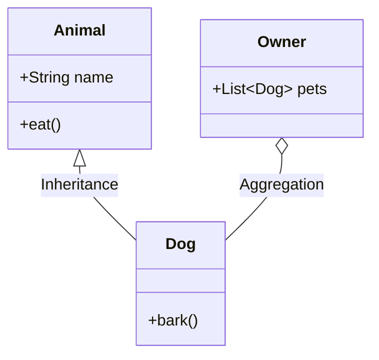

---
---

## Summary
The **Class Diagram** is the most common UML diagram, representing the **static structure** of a system. It depicts classes, their attributes, operations (methods), and the relationships among objects. It is the backbone of object-oriented modeling and directly maps to the code structure.

## Detailed Explanation

Class diagrams are used to visualize, describe, and document the static aspects of a system. They are essential during the design phase to define the "blueprint" of the software.

### Key Components

1.  **Class**: Represented by a rectangle divided into three parts:
    *   **Name**: The name of the class (e.g., `User`, `Order`).
    *   **Attributes**: Member variables or properties (e.g., `- name: String`).
    *   **Operations**: Methods or functions (e.g., `+ register(): void`).

2.  **Visibility**:
    *   `+` Public
    *   `-` Private
    *   `#` Protected
    *   `~` Package/Default

3.  **Relationships**:
    *   **Association**: A general relationship (solid line).
    *   **Inheritance (Generalization)**: "Is-a" relationship (solid line with hollow triangle).
    *   **Realization (Implementation)**: Class implements an interface (dashed line with hollow triangle).
    *   **Dependency**: "Uses-a" relationship (dashed line with arrow).
    *   **Aggregation**: "Has-a" relationship, weak ownership (solid line with hollow diamond). Child can exist independently.
    *   **Composition**: "Part-of" relationship, strong ownership (solid line with filled diamond). Child cannot exist without parent.

### Usage
*   **Domain Modeling**: Understanding the business entities and their links.
*   **Database Design**: Mapping classes to tables.
*   **Code Generation**: Many tools generate code stubs from class diagrams.

### Mermaid Example


## Go Example

In Go, **structs** replace classes, and **interfaces** define behavior. Inheritance is achieved through **embedding**, and relationships are fields.

```go
package main

import "fmt"

// 1. Generalization (Inheritance)
// Go uses Struct Embedding for "Is-a"
type Animal struct {
	Name string
}

func (a *Animal) Eat() {
	fmt.Println(a.Name, "is eating")
}

// Dog "inherits" from Animal
type Dog struct {
	Animal // Embedding
	Breed  string
}

func (d *Dog) Bark() {
	fmt.Println("Woof!")
}

// 2. Composition ("Part-of")
// The Engine cannot exist meaningfully without the Car in this model
type Engine struct {
	Horsepower int
}

type Car struct {
	Engine Engine // Composition (struct value)
}

// 3. Aggregation ("Has-a")
// The Department has Employees, but Employees exist independently
type Employee struct {
	ID int
}

type Department struct {
	Employees []*Employee // Aggregation (slice of pointers)
}

func main() {
	// Usage
	d := Dog{
		Animal: Animal{Name: "Rex"},
		Breed:  "German Shepherd",
	}
	d.Eat() // Access embedded method
	d.Bark()
}
```

## Interview Questions

### Q: What is the difference between Aggregation and Composition?
**A:** Both represent a "has-a" relationship. **Composition** is a strong relationship where the child lifecycle is bound to the parent (if parent is destroyed, child is destroyed). **Aggregation** is a weak relationship where the child can exist independently of the parent.

### Q: How do you represent an Interface in a Class Diagram?
**A:** An interface is often represented like a class but with the `<<interface>>` stereotype or a circle notation. Relationships using it use the **Realization** arrow (dashed line with hollow triangle).

### Q: Does Go have "Classes"? How does this affect the diagram?
**A:** Go does not have classes; it uses **structs**. In a UML Class Diagram for Go, structs are mapped as Classes. Methods are associated with structs via receivers. Interfaces are explicit types. The diagram structure remains valid, but implementation details (like embedding vs inheritance) differ.
