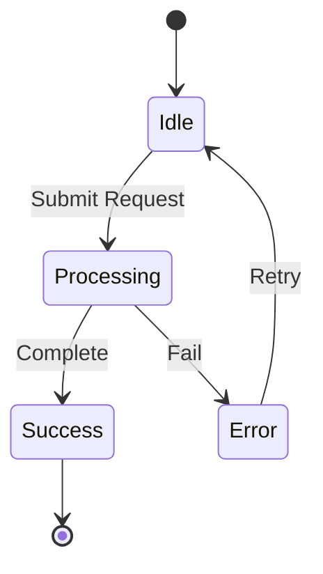

---
---

## Summary
The **State Machine Diagram** (or State Chart) models the **dynamic behavior** of a specific object over its lifetime. It shows the different **states** an object can be in and the **transitions** between those states triggered by **events**.

## Detailed Explanation

State diagrams are crucial for systems with complex lifecycles, such as order management systems, TCP connections, or game characters. They ensure all possible states and transitions are accounted for, preventing "impossible" states.

### Key Components

1.  **State**: Rounded rectangle (e.g., `Open`, `Closed`, `Pending`).
2.  **Initial State**: Solid black circle.
3.  **Final State**: Solid circle with border.
4.  **Transition**: Arrow connecting states.
5.  **Event/Trigger**: The action that causes the transition (e.g., `button_click`).
6.  **Guard**: A condition that must be true for the transition to occur (e.g., `[balance > 0]`).
7.  **Action**: Operation performed during transition or within a state (e.g., `/notifyUser`).

### Usage
*   **Object Lifecycle**: "Order" (New -> Paid -> Shipped -> Delivered).
*   **Protocol Design**: TCP connection states (SYN_SENT, ESTABLISHED).
*   **UI Logic**: Button states (Enabled, Disabled, Hover).

### Mermaid Example


## Go Example

In Go, State Machines are often implemented using the **State Pattern** (interfaces) or a simple `switch` statement/struct.

```go
package main

import "fmt"

// Define the Interface for the State
type State interface {
	Pay(o *Order)
	Ship(o *Order)
}

// Context: The Object holding the state
type Order struct {
	CurrentState State
}

func (o *Order) SetState(s State) {
	o.CurrentState = s
}

func (o *Order) Pay() {
	o.CurrentState.Pay(o)
}

func (o *Order) Ship() {
	o.CurrentState.Ship(o)
}

// Concrete State: Unpaid
type UnpaidState struct{}

func (s *UnpaidState) Pay(o *Order) {
	fmt.Println("Payment accepted.")
	o.SetState(&PaidState{}) // Transition to Paid
}

func (s *UnpaidState) Ship(o *Order) {
	fmt.Println("Cannot ship. Order is not paid.")
}

// Concrete State: Paid
type PaidState struct{}

func (s *PaidState) Pay(o *Order) {
	fmt.Println("Already paid.")
}

func (s *PaidState) Ship(o *Order) {
	fmt.Println("Shipping item...")
	// o.SetState(&ShippedState{})
}

func main() {
	order := &Order{CurrentState: &UnpaidState{}}
	
	order.Ship() // Fail
	order.Pay()  // Success -> Transition
	order.Ship() // Success
}
```

## Interview Questions

### Q: What is the difference between a State Diagram and an Activity Diagram?
**A:** A State Diagram focuses on **one object** and how its status changes over time (event-driven). An Activity Diagram focuses on a **process** or workflow involving multiple steps or objects (sequence-driven).

### Q: What is a "Guard Condition"?
**A:** A boolean expression associated with a transition. The transition only occurs if the event happens AND the guard evaluates to true.

### Q: Why use the State Pattern instead of if/else?
**A:** For simple logic, if/else is fine. For complex logic with many states, the State Pattern (polymorphism) encapsulates behavior specific to each state, making the code cleaner, testable, and compliant with the Open/Closed Principle.
