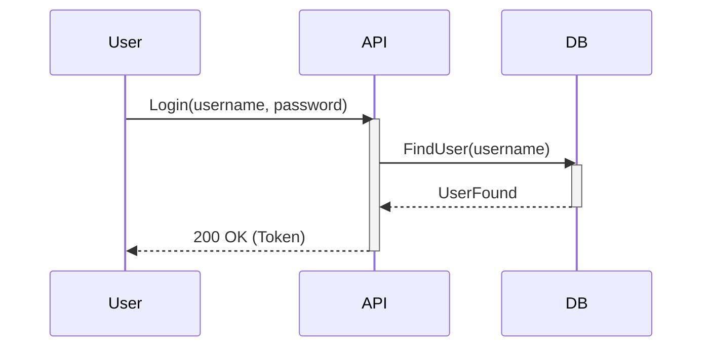

---
---

## Summary
The **Sequence Diagram** is an interaction diagram that shows **how objects operate with one another** and in **what order**. It models the exchange of messages (method calls) between objects over time. It is vital for visualizing API flows or distributed system interactions.

## Detailed Explanation

Sequence diagrams visualize the detailed logic of a usage scenario. Time flows vertically downwards, and objects/systems are arranged horizontally.

### Key Components

1.  **Lifeline**: A dashed vertical line representing the existence of an object over time.
    *   Top box: Object name (e.g., `:OrderService`).
2.  **Activation Bar**: A thin rectangle on the lifeline showing when the object is active (processing).
3.  **Messages**:
    *   **Synchronous**: Solid arrowhead (Request/Call). Caller waits.
    *   **Asynchronous**: Open arrowhead (Event/Message). Caller continues.
    *   **Return**: Dashed line with arrow (Response).
4.  **Fragments (Alt/Opt/Loop)**: Frames around a section to denote conditional logic (if/else) or loops.

### Usage
*   **API Design**: Visualizing Request/Response between Client, API, and DB.
*   **Debugging**: Tracing the path of a specific function call.
*   **System Integration**: Showing how microservices talk to each other.

### Mermaid Example


## Go Example

Sequence diagrams map almost 1:1 to the **call stack** or a sequence of function calls in Go.

```go
package main

import "fmt"

// Participants
type User struct{}
type API struct {
	DB Database
}
type Database struct{}

// Message Flow
func main() {
	user := User{}
	api := API{DB: Database{}}

	// User -> API: Login
	user.Login(api)
}

func (u User) Login(api API) {
	fmt.Println("User: Sending Login Request...")
	token := api.HandleLogin("user", "pass") // Synchronous Call
	fmt.Println("User: Received Token:", token)
}

func (api API) HandleLogin(user, pass string) string {
	fmt.Println("  API: Processing Login...")
	
	// API -> DB: FindUser
	found := api.DB.FindUser(user)
	
	if found {
		return "ABC-123" // Return Message
	}
	return ""
}

func (db Database) FindUser(user string) bool {
	fmt.Println("    DB: Querying User...")
	return true // Return Message
}
```

## Interview Questions

### Q: What is the difference between Synchronous and Asynchronous messages in a Sequence Diagram?
**A:** A **Synchronous** message (solid arrow) blocks the sender until a response is received (like a standard function call). An **Asynchronous** message (open arrow) allows the sender to continue processing immediately without waiting (like sending a message to a queue or starting a goroutine).

### Q: How do you represent "If/Else" logic?
**A:** Using an **Alt** (Alternative) fragment. The frame is divided into sections, one for "if" and one for "else", with guard conditions specified (e.g., `[valid user]` vs `[invalid user]`).

### Q: What is a "Lifeline"?
**A:** The vertical dashed line representing the participant. The existence of the object during the interaction. If the lifeline stops (with an X), the object is destroyed.
