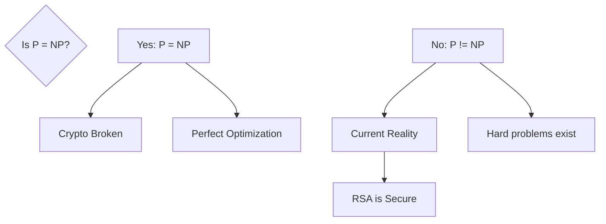

---
---

## Summary
The **P vs NP Problem** is the most famous unsolved problem in computer science. It asks whether every problem whose solution can be quickly verified (NP) can also be quickly solved (P). If P = NP, it would mean that for every problem with an easily checkable solution, there is also an efficient algorithm to find it. Most experts believe $P \neq NP$.

## Detailed Explanation
### The Question
Is **P = NP**?
*   **P**: Problems solvable in polynomial time.
*   **NP**: Problems verifiable in polynomial time.

Since $P \subseteq NP$ is already proven (if you can solve it, you can verify it), the question is strictly: **Is $NP \subseteq P$?**

### Implications if P = NP
1.  **Cryptography**: Most modern encryption (RSA, ECC) relies on factoring or discrete log being "hard" (not in P). If P=NP, these could be broken easily, collapsing internet security.
2.  **Optimization**: Perfect solutions to logistics, protein folding, and scheduling would become computationally trivial.
3.  **AI**: Automated theorem proving and pattern recognition would be vastly more efficient.

### Current Consensus
The majority of computer scientists believe **P ≠ NP**, meaning there are problems in NP that are fundamentally harder to solve than to verify.

### Go Context: The Impact
As a Go engineer, we currently assume $P \neq NP$. This is why we use:
*   **Heuristics**: Approximate solutions for NP-Hard problems (e.g., simulated annealing).
*   **Cryptography**: Libraries like `crypto/rsa` assume factoring is hard.

```go
package main

import (
	"fmt"
)

// The "P vs NP" concept in code:
// Checking a password hash is fast (Polynomial).
// Finding the password from the hash (Brute force) is slow (Exponential).
// If P = NP, we could find the password as fast as we check it.

func main() {
	secret := 42
	
	// Verifying (P-time operation)
	check := func(guess int) bool {
		return guess == secret
	}
	
	fmt.Println("Check 42:", check(42)) // Instant
	
	// Solving (NP search space)
	// If P != NP, we must iterate.
	// If P = NP, there would be a magic formula to find '42' instantly without iteration.
	found := false
	for i := 0; i < 100; i++ {
		if check(i) {
			fmt.Println("Found secret:", i)
			found = true
			break
		}
	}
    if !found { fmt.Println("Not found") }
}
```

## Interview Questions
**Q: What is the significance of the P vs NP problem?**
A: It determines the fundamental limits of computation. If solved (P=NP), it would revolutionize fields like biology and logistics but break modern cryptography.

**Q: Is P vs NP solved?**
A: No, it is one of the seven Millennium Prize Problems with a $1 million prize for a proof.

**Q: What does it mean if a problem is NP-Complete in the context of P vs NP?**
A: If any single NP-Complete problem can be solved in polynomial time, then ALL NP problems can be, proving P = NP.

## Diagram

