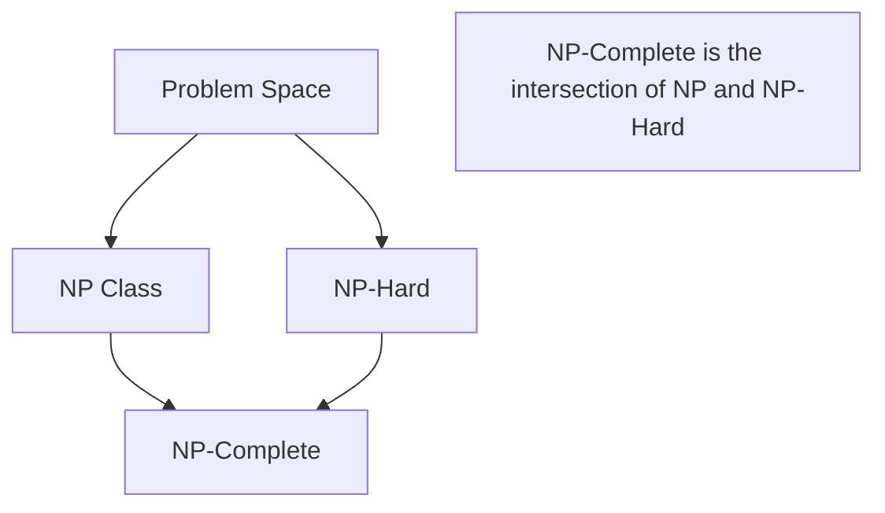

---
---

## Summary
**NP-Hard** problems are problems that are **at least as hard** as the hardest problems in NP. A problem $H$ is NP-Hard if every problem in NP can be reduced to $H$ in polynomial time. Importantly, NP-Hard problems do **not** have to be in NP themselves; they might not even be decidable (e.g., the Halting Problem).

## Detailed Explanation
### Definition
A problem $H$ is **NP-Hard** if:
$$ \forall L \in NP, L \leq_p H $$
This means if you had a "magic box" (oracle) that could solve $H$ instantly, you could solve every problem in NP efficiently.

### Characteristics
1.  **Not limited to NP**: They can be harder than NP (e.g., require exponential space or be undecidable).
2.  **No efficient solution known**: No polynomial-time algorithm is known for any NP-Hard problem.
3.  **Optimization Problems**: Often, the optimization version of a problem (find the *best* route) is NP-Hard, while the decision version (is there a route < X?) is NP-Complete.

### Examples
*   **Halting Problem**: Undecidable, thus NP-Hard.
*   **Travelling Salesman Problem (Optimization)**: Find the shortest path visiting all cities.

### Go Context
When you encounter an NP-Hard problem in engineering (like job scheduling or bin packing), do not try to find an exact solution for large inputs. Use **approximations**.

```go
package main

import "fmt"

// Conceptual: Handling NP-Hardness in Go
// We often use Heuristics (approximations) instead of exact solvers.

// BinPacking (NP-Hard): Fit items into minimum bins of capacity C.
// Exact solution is O(k^n).
// Heuristic solution (First Fit) is O(n log n).

func FirstFitHeuristic(items []int, capacity int) int {
	bins := []int{0} // Start with one empty bin
	
	for _, item := range items {
		placed := false
		// Try to fit item in existing bins
		for i := 0; i < len(bins); i++ {
			if bins[i] + item <= capacity {
				bins[i] += item
				placed = true
				break
			}
		}
		// If not placed, create new bin
		if !placed {
			bins = append(bins, item)
		}
	}
	return len(bins)
}

func main() {
	items := []int{2, 5, 4, 7, 1, 3, 8}
	capacity := 10
	binsUsed := FirstFitHeuristic(items, capacity)
	fmt.Printf("Approximate Bins Used: %d\n", binsUsed)
}
```

## Interview Questions
**Q: Can an NP-Hard problem be solved in polynomial time?**
A: If any NP-Hard problem can be solved in polynomial time, then $P = NP$. Currently, no such algorithm is known.

**Q: What is the difference between NP-Hard and NP-Complete?**
A: NP-Hard implies "at least as hard as NP". NP-Complete means "NP-Hard AND inside NP". NP-Hard problems might be undecidable; NP-Complete problems are always decidable.

**Q: Give an example of an NP-Hard problem that is not NP-Complete.**
A: The Halting Problem (it's undecidable, so not in NP).

## Diagram

