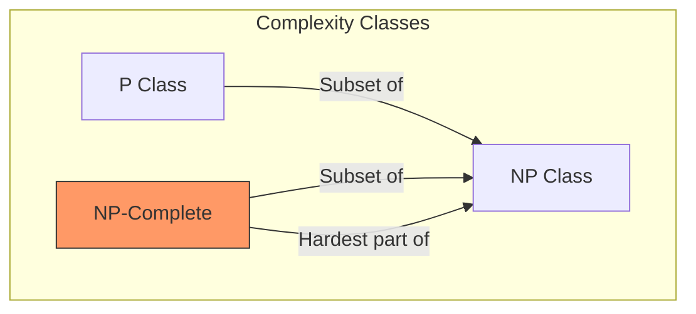

---
---

## Summary
**NP-Complete** problems are the "hardest" problems contained within the NP class. A problem is NP-Complete if it is (1) in NP and (2) NP-Hard. This means solutions can be verified quickly, but finding them is believed to require exponential time. Famous examples include SAT, 3-SAT, and the decision versions of TSP and Knapsack.

## Detailed Explanation
### The "Complete" Definition
NP-Complete problems are the key to the $P$ vs $NP$ question. They are "universal" in the sense that **any** problem in NP can be translated (reduced) to any NP-Complete problem.

1.  **In NP**: You can verify a solution in polynomial time.
2.  **NP-Hard**: Every other NP problem reduces to it.

### Cook-Levin Theorem
This theorem proved that **Boolean Satisfiability (SAT)** is NP-Complete. It was the first problem to be classified as such.

### Reducibility
To prove a new problem $X$ is NP-Complete:
1.  Show $X \in NP$.
2.  Pick a known NP-Complete problem $Y$ (like 3-SAT).
3.  Show $Y \leq_p X$ (Reduce Y to X).

### Go Application: Why verify?
In distributed systems, we often encounter NP-Complete problems like **Graph Partitioning** or **Leader Election** in complex constraints. We use Go to write *verifiers* or *heuristics*.

```go
package main

import "fmt"

// Example: 3-SAT Verifier
// 3-SAT is NP-Complete.
// Input: (A v B v !C) ^ (!A v D v E) ...
// Verifying a solution is O(N). Solving is O(2^N).

type Clause struct {
	vars [3]string
	signs [3]bool // true for positive (A), false for negation (!A)
}

func Verify3SAT(clauses []Clause, assignment map[string]bool) bool {
	for _, clause := range clauses {
		clauseSatisfied := false
		for i := 0; i < 3; i++ {
			val := assignment[clause.vars[i]]
			if clause.signs[i] == val { // true==true or false==false (negation matched false)
				clauseSatisfied = true
				break
			}
		}
		if !clauseSatisfied {
			return false
		}
	}
	return true
}

func main() {
	// Formula: (x1 OR x2 OR x3)
	c1 := Clause{vars: [3]string{"x1", "x2", "x3"}, signs: [3]bool{true, true, true}}
	
	// Assignment: x1=false, x2=false, x3=true
	assign := map[string]bool{"x1": false, "x2": false, "x3": true}
	
	valid := Verify3SAT([]Clause{c1}, assign)
	fmt.Println("Formula satisfied:", valid)
}
```

## Interview Questions
**Q: Define NP-Complete.**
A: A problem is NP-Complete if it is in NP and is NP-Hard. It is solvable by a nondeterministic machine in polynomial time and every other NP problem reduces to it.

**Q: Name three NP-Complete problems.**
A: SAT (Boolean Satisfiability), Travelling Salesman Problem (Decision version), Knapsack Problem (Decision version), Clique Problem.

**Q: What happens if you find a polynomial-time algorithm for ONE NP-Complete problem?**
A: You would prove that P = NP, and all NP problems would be solvable in polynomial time.

## Diagram

