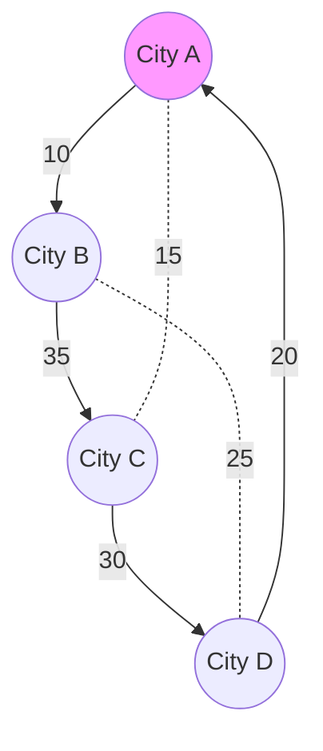

---
---

## Summary
The **Travelling Salesman Problem (TSP)** is a classic algorithmic problem in the fields of computer science and operations research. It asks: "Given a list of cities and the distances between each pair of cities, what is the shortest possible route that visits each city exactly once and returns to the origin city?" It is an **NP-Hard** problem in combinatorial optimization.

## Detailed Explanation
### Problem Statement
Given a set of cities $C = \{c_1, c_2, ..., c_n\}$ and distances $d(c_i, c_j)$, find a permutation $\pi$ of $1...n$ that minimizes:
$$ \sum_{i=1}^{n-1} d(c_{\pi(i)}, c_{\pi(i+1)}) + d(c_{\pi(n)}, c_{\pi(1)}) $$

### Complexity
*   **Brute Force**: checking all permutations takes $O(n!)$, which becomes impossible very quickly (e.g., $n=20$).
*   **Dynamic Programming (Held-Karp algorithm)**: Reduces time to $O(n^2 2^n)$. Still exponential, but much better than factorial.

### Go Implementation: Held-Karp Algorithm
This implementation uses bitmasking to track visited cities.

```go
package main

import (
	"fmt"
	"math"
)

const INF = 1e9

// TSP using Dynamic Programming (Held-Karp)
// Time Complexity: O(n^2 * 2^n)
// Space Complexity: O(n * 2^n)
func TSP(dist [][]int) int {
	n := len(dist)
	// dp[mask][i] = min cost to visit nodes in 'mask', ending at 'i'
	// mask is a bitmask where j-th bit is set if city j is visited.
	size := 1 << n
	dp := make([][]int, size)
	for i := range dp {
		dp[i] = make([]int, n)
		for j := range dp[i] {
			dp[i][j] = INF
		}
	}

	// Base case: Start at city 0
	dp[1][0] = 0

	for mask := 1; mask < size; mask++ {
		for u := 0; u < n; u++ {
			// If city u is in the current mask
			if (mask & (1 << u)) != 0 {
				for v := 0; v < n; v++ {
					// If city v is NOT in mask, try moving u -> v
					if (mask & (1 << v)) == 0 {
						newMask := mask | (1 << v)
						if dp[newMask][v] > dp[mask][u] + dist[u][v] {
							dp[newMask][v] = dp[mask][u] + dist[u][v]
						}
					}
				}
			}
		}
	}

	// Final step: return to start (city 0)
	minCost := INF
	fullMask := size - 1
	for i := 1; i < n; i++ {
		cost := dp[fullMask][i] + dist[i][0]
		if cost < minCost {
			minCost = cost
		}
	}
	return minCost
}

func main() {
	// Distance matrix (4 cities)
	dist := [][]int{
		{0, 10, 15, 20},
		{10, 0, 35, 25},
		{15, 35, 0, 30},
		{20, 25, 30, 0},
	}
	
	fmt.Println("Min TSP Cost:", TSP(dist))
}
```

## Interview Questions
**Q: Why is TSP hard?**
A: Because the number of possible routes grows factorially ($n!$). There is no known way to find the optimal solution without checking exponentially many possibilities.

**Q: Is there an approximation for TSP?**
A: Yes. For **Metric TSP** (where triangle inequality holds), the Minimum Spanning Tree (MST) heuristic gives a 2-approximation (solution is at most 2x optimal). Christofides' algorithm gives a 1.5-approximation.

**Q: What is the difference between Hamiltonian Cycle and TSP?**
A: Hamiltonian Cycle asks "does a tour exist?" (Decision problem, NP-Complete). TSP asks "what is the shortest tour?" (Optimization problem, NP-Hard).

## Diagram

