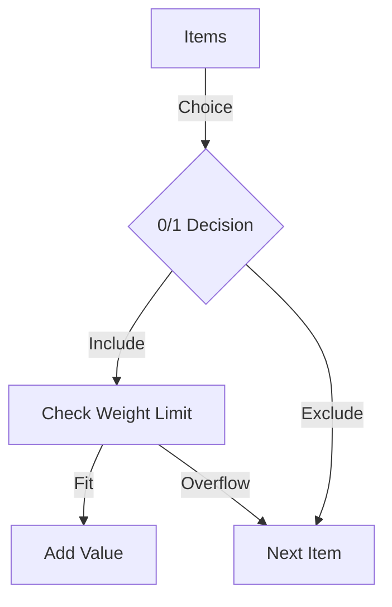

---
---

## Summary
The **Knapsack Problem** is a combinatorial optimization problem: Given a set of items, each with a weight and a value, determine the number of each item to include in a collection so that the total weight is less than or equal to a given limit and the total value is as large as possible. The **0/1 Knapsack Problem** (items cannot be split) is **NP-Complete**.

## Detailed Explanation
### Problem Variations
1.  **0/1 Knapsack**: Items are indivisible (take it or leave it). **NP-Complete**.
2.  **Fractional Knapsack**: Items can be broken (e.g., gold dust). Solvable in **Greedy** polynomial time ($O(n \log n)$).

### Complexity
While 0/1 Knapsack is NP-Complete, it can be solved in **pseudo-polynomial time** using Dynamic Programming. The complexity is $O(n \cdot W)$, where $n$ is items and $W$ is capacity. It is "pseudo" because $W$ depends on the *value* of the input number, not the number of bits (which is $\log W$).

### Go Implementation: Dynamic Programming
```go
package main

import (
	"fmt"
)

// Knapsack 0/1 using DP
// Time Complexity: O(n * capacity)
// Space Complexity: O(n * capacity)
func Knapsack(capacity int, weights []int, values []int) int {
	n := len(weights)
	// dp[i][w] = max value using first i items with capacity w
	dp := make([][]int, n+1)
	for i := range dp {
		dp[i] = make([]int, capacity+1)
	}

	for i := 1; i <= n; i++ {
		for w := 0; w <= capacity; w++ {
			if weights[i-1] <= w {
				// Option 1: Include item i
				valInclude := values[i-1] + dp[i-1][w-weights[i-1]]
				// Option 2: Exclude item i
				valExclude := dp[i-1][w]
				
				if valInclude > valExclude {
					dp[i][w] = valInclude
				} else {
					dp[i][w] = valExclude
				}
			} else {
				// Cannot include item i (too heavy)
				dp[i][w] = dp[i-1][w]
			}
		}
	}
	
	return dp[n][capacity]
}

func main() {
	values := []int{60, 100, 120}
	weights := []int{10, 20, 30}
	capacity := 50
	
	maxVal := Knapsack(capacity, weights, values)
	fmt.Printf("Maximum Value: %d\n", maxVal)
}
```

## Interview Questions
**Q: Why is Fractional Knapsack easy but 0/1 Knapsack hard?**
A: Fractional Knapsack has the "greedy choice property"—you always take the item with the highest value-per-weight ratio. In 0/1 Knapsack, taking a high-value item might use up awkward space that prevents an even better combination of other items.

**Q: What is pseudo-polynomial time?**
A: An algorithm runs in pseudo-polynomial time if its running time is polynomial in the *numeric value* of the input (like $W$ in knapsack), but exponential in the *length* (bits) of the input.

**Q: Real-world example of Knapsack?**
A: Resource allocation (budgeting), cargo loading, selecting project proposals under a budget.

## Diagram

