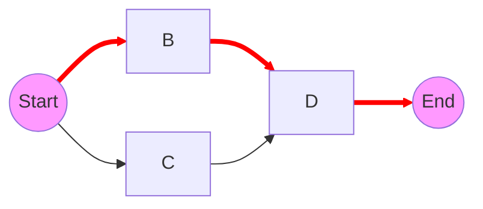

---
---

## Summary
The **Longest Path Problem** asks for the simple path of maximum length in a given graph. Unlike the Shortest Path problem (which is in P and solved by Dijkstra/BFS), finding the Longest Path is **NP-Hard** for general graphs. It implies there is no known efficient algorithm to find it without exploring all possibilities.

## Detailed Explanation
### Contrast with Shortest Path
*   **Shortest Path**: Has "optimal substructure". If $A \to B \to C$ is shortest, then $A \to B$ is also shortest. Solvable efficiently.
*   **Longest Path**: Does NOT have optimal substructure. A longest simple path might need to take a "detour" that prevents it from reusing sub-paths easily.

### Complexity
*   **General Graphs**: NP-Hard.
*   **DAGs (Directed Acyclic Graphs)**: Solvable in linear time $O(V+E)$ using topological sort. This is critical for project scheduling (Critical Path Method).

### Go Implementation: DFS Backtracking (Exponential)
Since the general problem is NP-Hard, we use backtracking to explore paths.

```go
package main

import (
	"fmt"
)

// Graph represented as Adjacency List
type Graph struct {
	V   int
	Adj [][]int
}

// FindLongestPath using Backtracking (Brute Force)
// Complexity: O(V!)
func (g *Graph) FindLongestPath(src int) int {
	visited := make([]bool, g.V)
	maxLen := 0
	g.dfs(src, 0, visited, &maxLen)
	return maxLen
}

func (g *Graph) dfs(u int, currentLen int, visited []bool, maxLen *int) {
	visited[u] = true
	
	if currentLen > *maxLen {
		*maxLen = currentLen
	}
	
	for _, v := range g.Adj[u] {
		if !visited[v] {
			g.dfs(v, currentLen+1, visited, maxLen)
		}
	}
	
	// Backtrack: unmark to allow this node in other paths
	visited[u] = false
}

func main() {
	// Example Graph
	// 0 -- 1
	// |    |
	// 2 -- 3
	g := Graph{
		V: 4,
		Adj: [][]int{
			{1, 2},    // Node 0
			{0, 3},    // Node 1
			{0, 3},    // Node 2
			{1, 2},    // Node 3
		},
	}
	
	// Longest path from 0 is 0->1->3->2 (length 3) or 0->2->3->1 (length 3)
	fmt.Println("Longest Path Length from 0:", g.FindLongestPath(0))
}
```

## Interview Questions
**Q: Why can't we use Dijkstra's algorithm for Longest Path?**
A: Dijkstra's algorithm relies on the fact that extending a path always increases (or stays same) cost non-negatively and locally optimal choices lead to global optimum. For Longest Path, taking a "long" edge now might block access to an even longer chain later. Also, negating weights and using Bellman-Ford doesn't work if positive cycles exist (which makes longest path infinite/undefined unless "simple path" is enforced).

**Q: In what case is Longest Path solvable in polynomial time?**
A: If the graph is a Directed Acyclic Graph (DAG). We can use dynamic programming or topological sort.

**Q: What is the real-world application of Longest Path?**
A: **Critical Path Method (CPM)** in project management. The longest path of dependent tasks determines the minimum time to complete the project.

## Diagram

