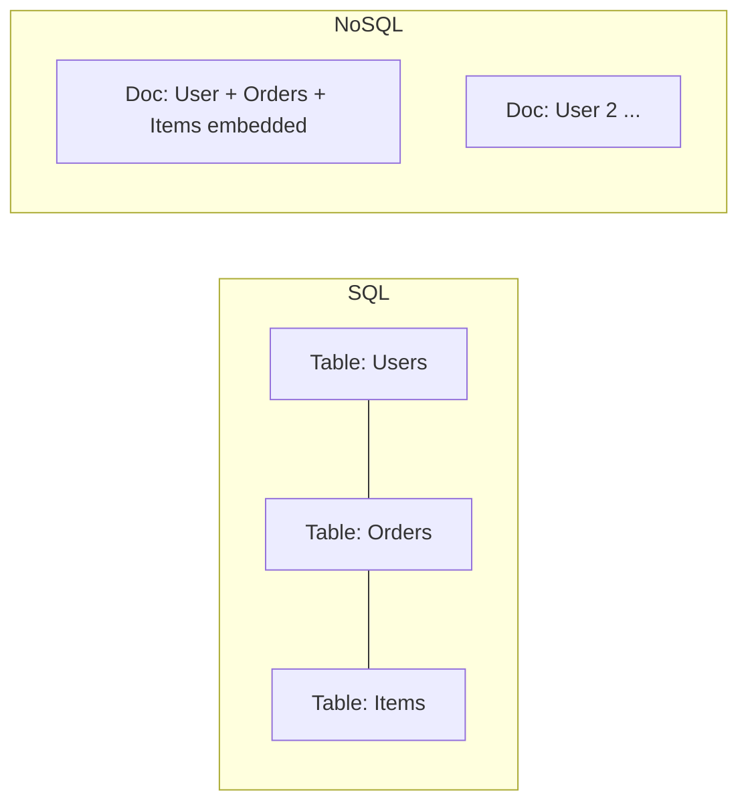

---
---

## Summary
The choice between **SQL (Relational)** and **NoSQL (Non-Relational)** databases is a fundamental architectural decision. SQL databases are structured, strict, and ACID-compliant, ideal for complex relationships. NoSQL databases are flexible, scalable, and often eventually consistent, ideal for high throughput and unstructured data.

## Detailed Explanation
### SQL (Relational Databases)
*   **Structure**: Tables with fixed rows and columns (Schema).
*   **Data**: Structured data with relationships (Foreign Keys).
*   **Scaling**: Vertical Scaling (Add more CPU/RAM to one server). Harder to shard.
*   **Properties**: ACID (Atomicity, Consistency, Isolation, Durability).
*   **Query Language**: SQL (Standardized).
*   **Examples**: PostgreSQL, MySQL, Oracle, SQL Server.

### NoSQL (Non-Relational Databases)
*   **Structure**: Flexible schemas (Document, Key-Value, Graph, Wide-Column).
*   **Data**: Unstructured or semi-structured.
*   **Scaling**: Horizontal Scaling (Add more servers/nodes). Built for sharding.
*   **Properties**: BASE (Basically Available, Soft state, Eventual consistency) - typically AP or CP in CAP theorem.
*   **Examples**: MongoDB (Document), Redis (Key-Value), Cassandra (Wide-Column), Neo4j (Graph).

### Comparison Table
| Feature | SQL | NoSQL |
| :--- | :--- | :--- |
| **Schema** | Rigid, predefined | Dynamic, flexible |
| **Relations** | JOINs supported | JOINs usually not supported |
| **Transactions** | ACID (Strong) | ACID (rare) or BASE (Eventual) |
| **Scaling** | Vertical | Horizontal |
| **Best For** | Financial systems, CRM, complex queries | Content mgmt, Real-time big data, Caching |

### Go Context
In Go, the driver ecosystem is distinct:
*   **SQL**: Use `database/sql` standard library (with drivers like `pq`, `mysql`) or ORMs like GORM/Sqlc.
*   **NoSQL**: Use specific drivers (e.g., `mongo-driver` for MongoDB, `go-redis` for Redis).

## Interview Questions
**Q: When would you choose NoSQL over SQL?**
A: When data structure changes frequently (schema flexibility), when massive write throughput is required (horizontal scaling), or when data is naturally graph-like or hierarchical without strict joins.

**Q: Can SQL databases scale horizontally?**
A: Yes, via Sharding (partitioning data across nodes) or Read Replicas, but it is operationally complex compared to NoSQL databases which often have sharding built-in.

**Q: Is NoSQL faster than SQL?**
A: Not necessarily. NoSQL is faster for simple lookups (Key-Value) and writes (append-only logs), but SQL is often much faster and more efficient for complex analytical queries involving joins and aggregations.

## Diagram

