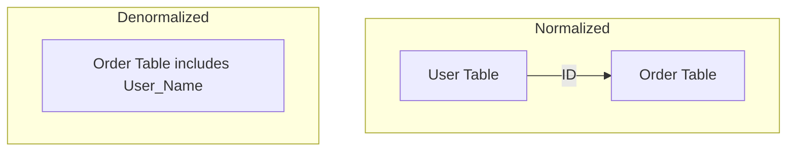

---
---

## Summary
**Normalization** is the process of organizing data in a database to reduce redundancy and improve data integrity. **Denormalization** is the strategy of adding redundant data to optimize read performance. The choice depends on the read/write ratio and performance requirements of the application.

## Detailed Explanation
### Normalization (Write Optimization)
The goal is to store each piece of data exactly once.
*   **1NF (First Normal Form)**: Atomic values (no lists in columns), unique rows.
*   **2NF**: 1NF + No partial dependencies (all non-key columns depend on the *whole* primary key).
*   **3NF**: 2NF + No transitive dependencies (non-key columns depend *only* on the primary key, not other non-key columns). "The key, the whole key, and nothing but the key."

**Pros**: Consistent data, smaller size, faster writes.
**Cons**: Complex queries (many JOINs), slower reads.

### Denormalization (Read Optimization)
Intentionally introducing redundancy (e.g., storing `user_name` in the `orders` table) to avoid expensive JOINs.

**Pros**: Faster reads, simpler queries.
**Cons**: Data inconsistency risk (must update multiple places), larger storage, slower writes.

### Go Context
In Go microservices, we often **denormalize** across service boundaries.
*   Example: Service A (Users) owns `User`. Service B (Orders) might store a copy of `user_email` in its `Order` struct/table to avoid calling Service A for every order display.
*   **Trade-off**: If the user changes their email, Service B has stale data (Eventual Consistency).

## Interview Questions
**Q: Explain 3NF to a 5-year-old.**
A: Every piece of information in a table should be about the specific thing identified by the ID (Primary Key), not about something else indirectly related.

**Q: When should you denormalize?**
A: When you have a heavy read-load, your application is suffering from "JOIN pain" (too many joins slowing down queries), and you can accept some data staleness or have a robust mechanism (like event sourcing) to update redundant data.

**Q: Does normalization eliminate all redundancy?**
A: No, Foreign Keys are technically redundant data required to establish relationships, but normalization eliminates *uncontrolled* redundancy.

## Diagram

