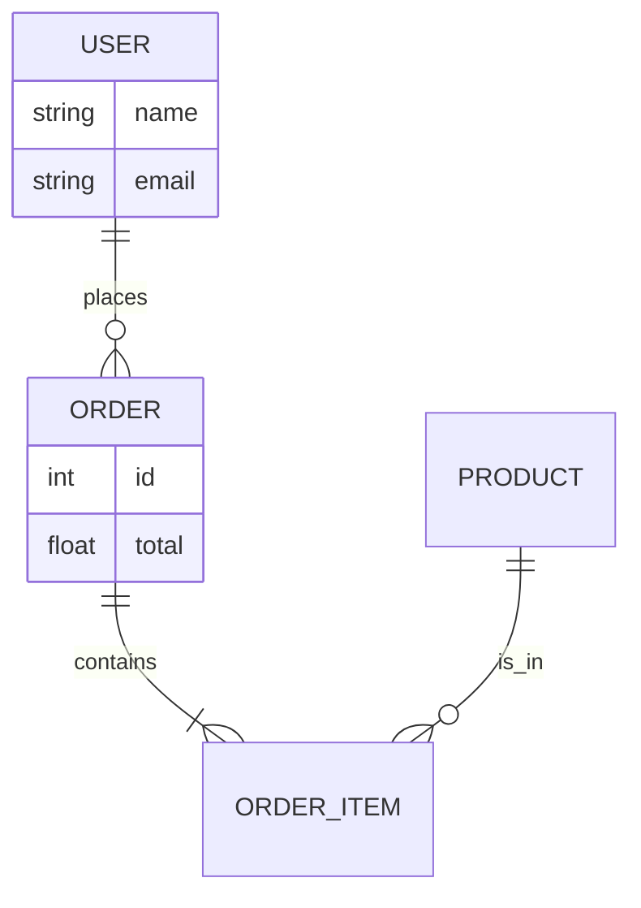

---
---

## Summary
The **Entity-Relationship (ER) Model** is a conceptual framework used to define the data structure of a system. It describes the **Entities** (objects/concepts), their **Attributes** (properties), and the **Relationships** between them. It is the blueprint phase before creating the actual database schema.

## Detailed Explanation
### Components
1.  **Entity**: A real-world object (e.g., User, Product). Maps to a Table.
2.  **Attribute**: A property of an entity (e.g., Email, Price). Maps to a Column.
3.  **Relationship**: How entities interact. Maps to Foreign Keys or Join Tables.

### Relationship Types
*   **One-to-One (1:1)**: A User has one Profile. (FK in either table).
*   **One-to-Many (1:N)**: A User has many Orders. (FK in the "Many" side table).
*   **Many-to-Many (N:M)**: Students have many Courses, Courses have many Students. (Requires a **Junction Table**).

### Crow's Foot Notation
Standard notation for ER Diagrams:
*   `||`: Mandatory One.
*   `|`: Optional One.
*   `|<`: Mandatory Many.
*   `O<`: Optional Many.

### Go Context
In Go struct design (ORM like GORM):
```go
// One-to-Many
type User struct {
    gorm.Model
    Name   string
    Orders []Order // Has Many
}

type Order struct {
    gorm.Model
    UserID uint   // Foreign Key
    Price  float64
}
```

## Interview Questions
**Q: How do you implement a Many-to-Many relationship in a relational database?**
A: You cannot do it directly between two tables. You must create a third table (Junction/Associative Table) that contains Foreign Keys to both related tables.

**Q: What is a recursive relationship?**
A: An entity related to itself. Example: `Employee` table with a `ManagerID` column that refers to the `ID` of another row in the same `Employee` table.

## Diagram

