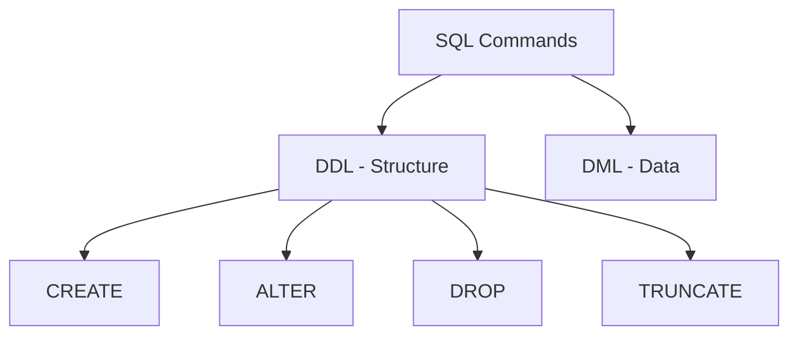

---
---

## Summary
**DDL (Data Definition Language)** consists of SQL commands used to define the database schema. It deals with creating and modifying the structure of database objects (tables, indexes, views, schemas) rather than manipulating the data within them. DDL commands are typically auto-committed (cannot be rolled back in some DBs like Oracle, though PostgreSQL allows transactional DDL).

## Detailed Explanation
DDL commands shape the "container" of the data.

### Key Commands
1.  **CREATE**: Creates a new database object (table, view, index).
2.  **ALTER**: Modifies an existing database object (add column, change data type).
3.  **DROP**: Deletes an entire database object and its data.
4.  **TRUNCATE**: Removes all records from a table (resets identity) but keeps the structure. Faster than DELETE.
5.  **RENAME**: Renames an object.

### DDL vs DML
*   **DDL**: Changes structure (Schema). "Construction work".
*   **DML**: Changes data (Rows). "Daily operations".

### Go Context
In Go, DDL is executed using `db.Exec()` just like DML, but it usually returns `Result` with 0 rows affected.

```go
package main

import (
	"database/sql"
	"log"
)

func createSchema(db *sql.DB) {
	// DDL Command: CREATE TABLE
	query := `
		CREATE TABLE IF NOT EXISTS users (
			id SERIAL PRIMARY KEY,
			username VARCHAR(50) NOT NULL UNIQUE,
			created_at TIMESTAMP DEFAULT CURRENT_TIMESTAMP
		);
	`
	_, err := db.Exec(query)
	if err != nil {
		log.Fatalf("Failed to execute DDL: %v", err)
	}
	log.Println("Schema created successfully")
}
```

## Interview Questions
**Q: What is the difference between DELETE and TRUNCATE?**
A: `DELETE` is a DML command that removes rows one by one (can use WHERE, logs each deletion, slower, triggers fire). `TRUNCATE` is a DDL command that deallocates pages (removes all data instantly, resets auto-increment counters, cannot use WHERE, minimal logging, usually cannot be rolled back in some DBs).

**Q: Can DDL commands be rolled back?**
A: It depends on the database. In PostgreSQL, DDL is transactional and can be rolled back. In MySQL and Oracle, DDL statements cause an implicit commit, meaning they cannot be rolled back.

**Q: What happens if you ALTER a table with millions of rows?**
A: It can lock the table for a long time depending on the operation (e.g., adding a NOT NULL column with a default value used to require a full table rewrite). Modern DBs have optimizations for "online DDL".

## Diagram

