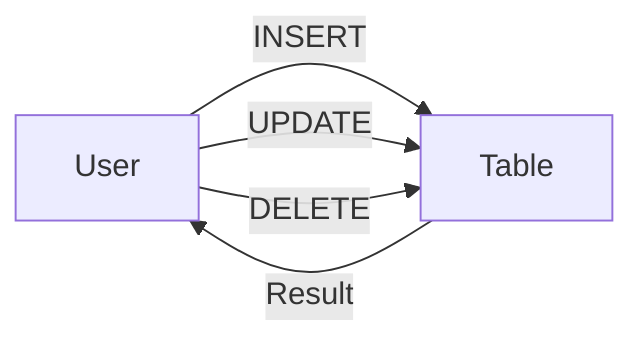

---
---

## Summary
**DML (Data Manipulation Language)** consists of SQL commands used to manage data within existing schema objects. It allows users to insert, update, retrieve (though `SELECT` is often separated as DQL), and delete data. DML commands are not auto-committed by default and can be rolled back within a transaction.

## Detailed Explanation
DML is the language of "CRUD" (Create, Read, Update, Delete) operations, though "Read" is technically DQL.

### Key Commands
1.  **INSERT**: Adds new rows to a table.
2.  **UPDATE**: Modifies existing data in a table.
3.  **DELETE**: Removes specific rows from a table.
4.  **MERGE / UPSERT**: Inserts if not exists, updates if exists.

### Transaction Control
DML operations are transaction-safe.
*   **COMMIT**: Saves changes permanently.
*   **ROLLBACK**: Undoes changes since the last commit.

### Go Context
In Go's `database/sql`, DML is executed with `db.Exec()`.

```go
package main

import (
	"database/sql"
	"fmt"
)

func manageData(db *sql.DB) {
	// 1. INSERT (Create)
	res, _ := db.Exec("INSERT INTO users (username) VALUES ($1)", "jdoe")
	id, _ := res.LastInsertId()
	fmt.Println("Inserted ID:", id)

	// 2. UPDATE (Update)
	db.Exec("UPDATE users SET username = $1 WHERE id = $2", "john_doe", id)

	// 3. DELETE (Delete)
	db.Exec("DELETE FROM users WHERE id = $1", id)
}
```

## Interview Questions
**Q: What is the difference between DELETE and TRUNCATE?**
A: DELETE is DML (transactional, row-by-row, slow, triggers). TRUNCATE is DDL (structure reset, fast, no triggers).

**Q: What is an Upsert?**
A: A combination of UPDATE and INSERT. "Insert this row; if the primary key already exists, update the existing row instead." In PostgreSQL: `INSERT ... ON CONFLICT DO UPDATE`. In MySQL: `INSERT ... ON DUPLICATE KEY UPDATE`.

**Q: Why is `SELECT` sometimes not considered DML?**
A: Because `SELECT` only reads data without manipulating (changing) it. However, functionally, it is often grouped with DML in broader contexts. The strict separation calls it **DQL** (Data Query Language).

## Diagram

