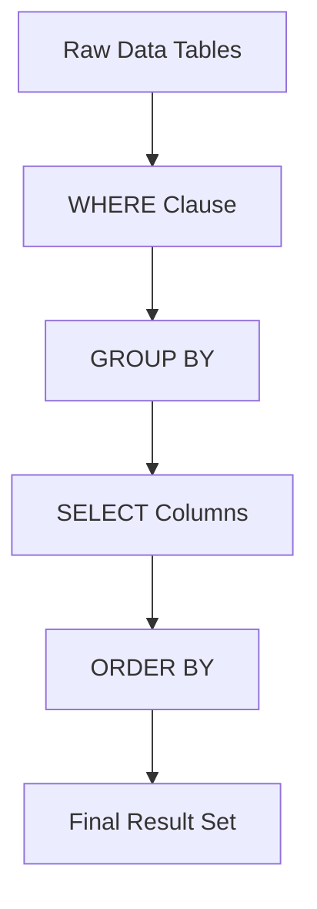

---
---

## Summary
**DQL (Data Query Language)** is the subset of SQL reserved for retrieving data from the database. It consists of a single, powerful command: **SELECT**. While often grouped under DML, DQL is distinct because it does not modify the state of the data, only reads it.

## Detailed Explanation
The `SELECT` statement is the most complex command in SQL, capable of filtering, grouping, joining, and transforming data.

### Structure of a Query
Order of Execution (Logical):
1.  **FROM / JOIN**: Determine the source tables.
2.  **WHERE**: Filter rows.
3.  **GROUP BY**: Aggregate rows.
4.  **HAVING**: Filter aggregated groups.
5.  **SELECT**: Return columns/calculations.
6.  **ORDER BY**: Sort results.
7.  **LIMIT / OFFSET**: Paging.

### Key Concepts
*   **Projections**: Selecting specific columns (`SELECT name` vs `SELECT *`).
*   **Joins**: Combining data from multiple tables (`INNER`, `LEFT`, `RIGHT`, `FULL`).
*   **Aggregations**: `COUNT`, `SUM`, `AVG`, `MAX`, `MIN`.
*   **Subqueries**: Queries nested inside other queries.

### Go Context
In Go, DQL is executed using `db.Query()` (for multiple rows) or `db.QueryRow()` (for single row). You must scan the results into variables.

```go
package main

import (
	"database/sql"
	"fmt"
	"log"
)

type User struct {
	ID       int
	Username string
}

func queryData(db *sql.DB) {
	// DQL: SELECT
	rows, err := db.Query("SELECT id, username FROM users WHERE id > $1", 0)
	if err != nil {
		log.Fatal(err)
	}
	defer rows.Close() // Important!

	for rows.Next() {
		var u User
		if err := rows.Scan(&u.ID, &u.Username); err != nil {
			log.Fatal(err)
		}
		fmt.Printf("User: %d - %s\n", u.ID, u.Username)
	}
	
	// Check for errors during iteration
	if err := rows.Err(); err != nil {
		log.Fatal(err)
	}
}
```

## Interview Questions
**Q: What is the logical order of execution for a SQL query?**
A: FROM $\to$ WHERE $\to$ GROUP BY $\to$ HAVING $\to$ SELECT $\to$ ORDER BY $\to$ LIMIT. This explains why you cannot use a column alias defined in SELECT inside the WHERE clause.

**Q: What is the difference between WHERE and HAVING?**
A: `WHERE` filters individual rows *before* aggregation. `HAVING` filters groups *after* aggregation.

**Q: Explain the difference between INNER JOIN and LEFT JOIN.**
A: `INNER JOIN` returns only rows where there is a match in both tables. `LEFT JOIN` returns all rows from the left table, and matched rows from the right (or NULL if no match).

## Diagram

