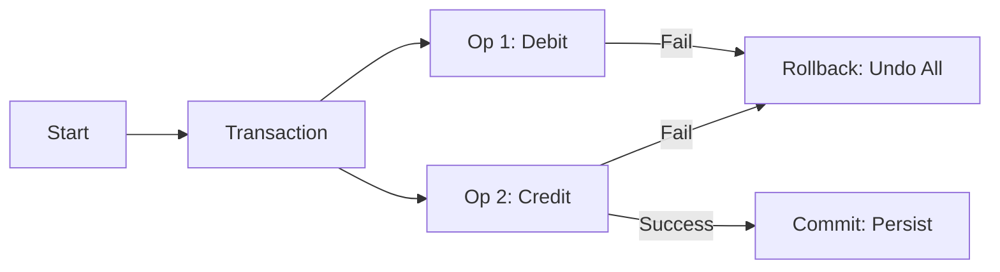

---
---

## Summary
**ACID** is a set of properties that guarantee database transactions are processed reliably. It stands for **Atomicity**, **Consistency**, **Isolation**, and **Durability**. These properties ensure data integrity even in the event of errors, power failures, or crashes.

## Detailed Explanation
### The 4 Properties
1.  **Atomicity** ("All or Nothing"): A transaction is treated as a single unit. Either all its operations succeed, or none of them do. If one part fails, the entire transaction is rolled back.
2.  **Consistency** ("Valid State"): A transaction brings the database from one valid state to another, maintaining all invariants (constraints, foreign keys, triggers).
3.  **Isolation** ("Private Scope"): Concurrent transactions do not interfere with each other. The intermediate state of a transaction is invisible to others (depending on the Isolation Level).
4.  **Durability** ("Forever"): Once a transaction is committed, it remains committed even if the system crashes immediately after (typically ensured via Write-Ahead Logging - WAL).

### Go Context
Using `database/sql` transactions enforces ACID on the client side.

```go
package main

import (
	"database/sql"
	"log"
)

func transferFunds(db *sql.DB, fromID, toID int, amount float64) {
	// Start Transaction (Atomicity context)
	tx, err := db.Begin()
	if err != nil {
		log.Fatal(err)
	}
	// Defer Rollback in case of panic or error
	defer tx.Rollback()

	// Step 1: Debit
	if _, err := tx.Exec("UPDATE accounts SET balance = balance - $1 WHERE id = $2", amount, fromID); err != nil {
		return // Triggers deferred Rollback
	}

	// Step 2: Credit
	if _, err := tx.Exec("UPDATE accounts SET balance = balance + $1 WHERE id = $2", amount, toID); err != nil {
		return // Triggers deferred Rollback
	}

	// Commit (Durability)
	if err := tx.Commit(); err != nil {
		log.Fatal(err)
	}
}
```

## Interview Questions
**Q: Which ACID property handles concurrent transactions?**
A: **Isolation**. It ensures that multiple transactions executing at the same time do not result in data inconsistency (e.g., Dirty Reads, Phantom Reads).

**Q: How do databases implement Durability?**
A: Usually via a **Write-Ahead Log (WAL)** or Transaction Log. Data is written to an append-only log on disk *before* it is applied to the main database files. If the power fails, the DB replays the log upon restart.

**Q: Does Atomicity handle system crashes?**
A: Technically **Atomicity** handles the logical rollback of an incomplete transaction, but **Durability** is what ensures the *completed* ones survive the crash. They work together.

## Diagram

