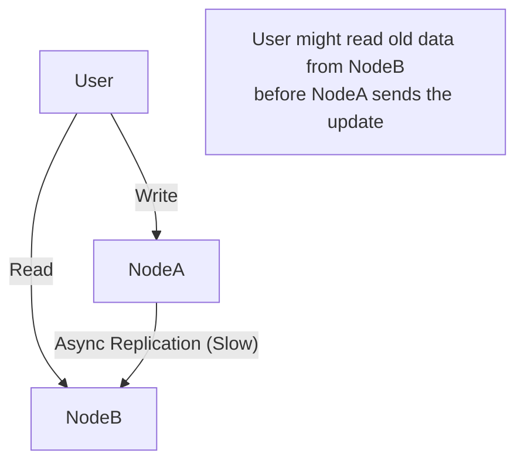

---
---

## Summary
**BASE** is a database consistency model often used in NoSQL systems that prioritize Availability and Partition Tolerance over strict Consistency (ACID). It stands for **Basically Available**, **Soft state**, and **Eventual consistency**. It accepts that data might be stale for a short period to ensure the system remains fast and online.

## Detailed Explanation
### The Properties
1.  **Basically Available**: The system guarantees availability (you get a response), but it might be a "failure" response or allow accessing partial data if some nodes are down.
2.  **Soft State**: The state of the system may change over time, even without input (due to eventual consistency convergence).
3.  **Eventual Consistency**: The system will eventually become consistent once it stops receiving input. Updates propagate to all nodes given enough time.

### Contrast with ACID
*   **ACID**: Pessimistic. "I will lock this data until I am sure everyone agrees." (Focus: Correctness).
*   **BASE**: Optimistic. "I will accept this write and tell everyone later." (Focus: Speed/Uptime).

### Go Context
When working with BASE systems (like Cassandra or DynamoDB) in Go:
*   Your application logic must handle **stale data**.
*   You might read a value you just wrote and get the old version.
*   **Conflict Resolution**: Your Go code might need to handle "Last Write Wins" or merge conflicts.

## Interview Questions
**Q: What is the main trade-off of BASE?**
A: You trade **Strong Consistency** for **High Availability** and Performance. You accept the risk that a user might see outdated data for a few milliseconds (or seconds).

**Q: Give a real-world example where BASE is acceptable.**
A: Social media "Likes" count. If a post has 1,000 likes and I like it, it's okay if other users see 1,000 for a few seconds before seeing 1,001. It's not critical (unlike a bank balance).

## Diagram

