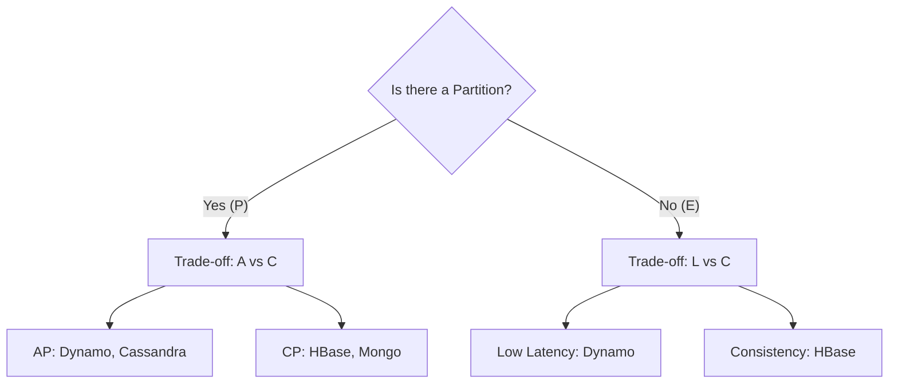

---
---

## Summary
**PACELC** is an extension of the CAP theorem. It states: "If there is a **P**artition (P), one must choose between **A**vailability (A) and **C**onsistency (C). **E**lse (E), when the system is running normally (no partition), one must choose between **L**atency (L) and **C**onsistency (C)." This theorem addresses the reality that partitions are rare, but latency/consistency trade-offs happen on every request.

## Detailed Explanation
### The Logic
$$ P \implies (A \lor C) $$
$$ E \implies (L \lor C) $$

*   **Partition Phase (PAC)**: Same as CAP. Do you want uptime or correctness when the cable is cut?
*   **Normal Phase (ELC)**: Do you want to wait for replication to finish before confirming a write (Consistency implies high Latency), or do you return immediately and replicate in the background (Low Latency implies weaker Consistency)?

### Examples
*   **DynamoDB / Cassandra (PA/EL)**: Prioritizes Availability during partitions, and Latency during normal ops (Eventual Consistency).
*   **BigTable / HBase (PC/EC)**: Prioritizes Consistency during partitions, and Consistency during normal ops (blocks until data is safe).
*   **MongoDB (PC/EC)**: Default is strong consistency (read from primary), trading latency for it.

### Go Context
In Go, this manifests in configuring database write concerns.
*   **MongoDB Driver**: `w=1` (Low Latency, weak consistency), `w=majority` (High Latency, strong consistency).
*   **Application Logic**: Do you block the HTTP request until the data is replicated?

## Interview Questions
**Q: How does PACELC improve on CAP?**
A: CAP only describes system behavior during failures (Partitions). PACELC describes the behavior during *normal operation* as well, forcing architects to admit that Strong Consistency always comes with a Latency penalty (waiting for replication).

**Q: If I choose "L" (Latency) in PACELC, what do I lose?**
A: You lose Strong Consistency during normal operation. You accept that a read immediately following a write might return old data.

## Diagram

