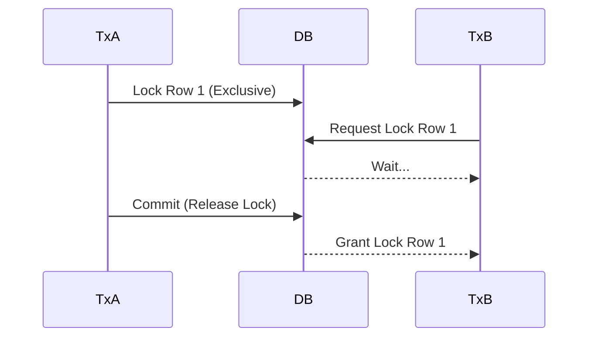

---
---

## Summary
**Locking** is a mechanism used by databases to manage concurrent access to data, ensuring **Consistency** and **Isolation**. Locks prevent multiple transactions from modifying the same data simultaneously in conflicting ways. Key concepts include granularity (Row/Table), mode (Shared/Exclusive), and MVCC.

## Detailed Explanation
### Types of Locks
1.  **Shared Lock (S)**: "Read Lock". Multiple transactions can hold S-locks. Prevents writing.
2.  **Exclusive Lock (X)**: "Write Lock". Only one transaction can hold an X-lock. Prevents reading (unless dirty read) and writing.

### Optimistic vs Pessimistic
*   **Pessimistic Locking**: Assume conflict will happen. Lock data *before* reading/writing. "Don't touch this until I'm done."
*   **Optimistic Locking**: Assume conflict is rare. Don't lock. Check version/timestamp *before* committing. "Check if anyone changed this while I was working."

### MVCC (Multi-Version Concurrency Control)
Modern DBs (Postgres, MySQL InnoDB) use MVCC to avoid locking for readers. Readers read a "snapshot" of the data as it existed at the start of the transaction, so **Readers don't block Writers** and **Writers don't block Readers**.

### Go Context
Implementing **Optimistic Locking** in Go application logic:

```go
package main

import (
	"database/sql"
	"errors"
	"fmt"
)

// Optimistic Update
func UpdateProduct(db *sql.DB, id int, newPrice float64, oldVersion int) error {
	// Only update if 'version' matches what we read earlier
	res, err := db.Exec("UPDATE products SET price = $1, version = version + 1 WHERE id = $2 AND version = $3", 
		newPrice, id, oldVersion)
	
	if err != nil {
		return err
	}
	
	rows, _ := res.RowsAffected()
	if rows == 0 {
		return errors.New("concurrent modification detected") // Retry logic needed here
	}
	return nil
}
```

## Interview Questions
**Q: What causes a Deadlock?**
A: A cycle of dependencies. Transaction A holds Lock 1 and waits for Lock 2. Transaction B holds Lock 2 and waits for Lock 1. Neither can proceed.

**Q: How does MVCC improve performance?**
A: It eliminates the need for Read locks. A long-running report query (Reader) won't block a user trying to update a row (Writer), because the reader sees an old version of the row.

**Q: Explain Row-level vs Table-level locking.**
A: Row-level allows high concurrency (only 1 row locked), but consumes more memory (many lock objects). Table-level locks the whole table (low concurrency) but is cheap (1 lock object).

## Diagram

