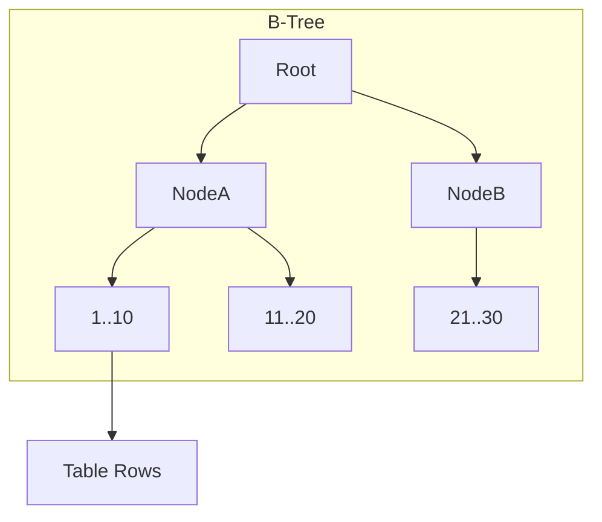

---
---

## Summary
**Indexes** are data structures that improve the speed of data retrieval operations on a database table at the cost of additional writes and storage space. They function like a book's index, allowing the DB engine to find rows without scanning the entire table.

## Detailed Explanation
### Types of Indexes
1.  **B-Tree**: The most common. Balanced tree. Good for equality (`=`) and ranges (`<`, `>`).
2.  **Hash**: Fast for equality (`=`), but cannot handle ranges.
3.  **Bitmap**: Good for low-cardinality columns (e.g., Gender, Boolean) in data warehouses.

### Clustered vs Non-Clustered
*   **Clustered Index**: The data *is* the index. The rows are physically stored in sorted order on disk. Only one per table (usually Primary Key).
*   **Non-Clustered Index**: A separate structure containing the Key and a pointer to the actual data row (heap or clustered index key). Can have many per table.

### Composite & Covering
*   **Composite Index**: Index on multiple columns `(A, B)`. Order matters (Leftmost Prefix Rule).
*   **Covering Index**: An index that contains *all* the fields required by a query, allowing the DB to skip reading the actual table row.

### Go Context
Database indexing is handled via DDL, but your Go query patterns dictate *which* indexes you need.
*   **Optimization**: If your Go app runs `SELECT * FROM users WHERE email = ?` frequently, you MUST ensure `email` is indexed.

## Interview Questions
**Q: Why shouldn't you index every column?**
A: Indexes slow down WRITE operations (INSERT/UPDATE/DELETE) because the DB must update the index structure as well. They also consume disk and memory.

**Q: What is the "Leftmost Prefix" rule?**
A: If you have a composite index on `(A, B, C)`, the index can support queries filtering on `A`, or `(A, B)`, or `(A, B, C)`. It generally *cannot* help a query filtering only on `B` or `C`.

**Q: What is the difference between a Clustered and Non-Clustered index?**
A: Clustered determines physical storage order (only 1 per table). Non-clustered is a separate pointer list (multiple allowed).

## Diagram

