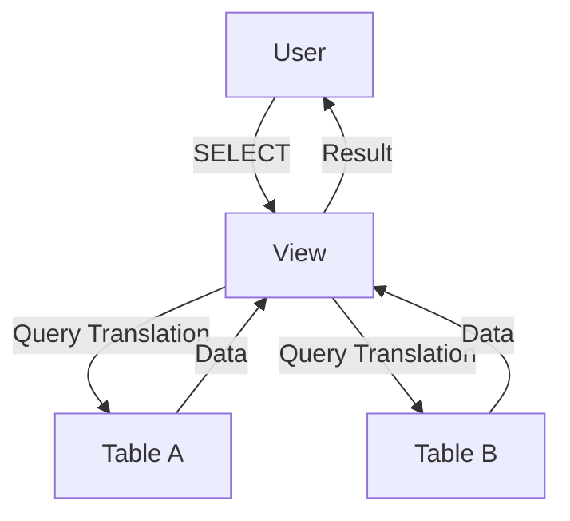

---
---

## Summary
**Views** are virtual tables represented by a stored query. They do not store data themselves (except Materialized Views) but display data dynamically from underlying tables. They are used for simplifying complex queries, restricting access (security), and formatting data.

## Detailed Explanation
### Types of Views
1.  **Standard View**: A stored SQL query. Computed on-the-fly every time you access it.
    *   `CREATE VIEW active_users AS SELECT * FROM users WHERE status = 'active';`
2.  **Materialized View**: Stores the *result* of the query physically on disk.
    *   **Pros**: Extremely fast reads for complex aggregations.
    *   **Cons**: Data is stale. Must be "refreshed" (recalculated) periodically.

### Use Cases
*   **Security**: Grant access to a View (e.g., `employee_public_info`) instead of the full Table (which contains `salary`).
*   **Simplicity**: Abstract away complex JOINs for application developers.

### Go Context
To a Go application, a View looks exactly like a Table. You query it using standard `SELECT`.

```go
// Querying a View is identical to a Table
rows, err := db.Query("SELECT username, last_login FROM view_active_users")
```

## Interview Questions
**Q: Can you update data through a View?**
A: Sometimes. If the view is "simple" (maps 1:1 to a table, no aggregations, no DISTINCT), most DBs allow updates. If it contains complex logic (GROUP BY, JOIN), it is usually read-only.

**Q: When would you use a Materialized View?**
A: For heavy analytical queries (e.g., "Daily Sales Summary") that take too long to compute in real-time and where real-time accuracy is not critical (e.g., 1-hour lag is okay).

**Q: What happens to a View if you drop the underlying table?**
A: The View becomes invalid. Queries to it will fail.

## Diagram

