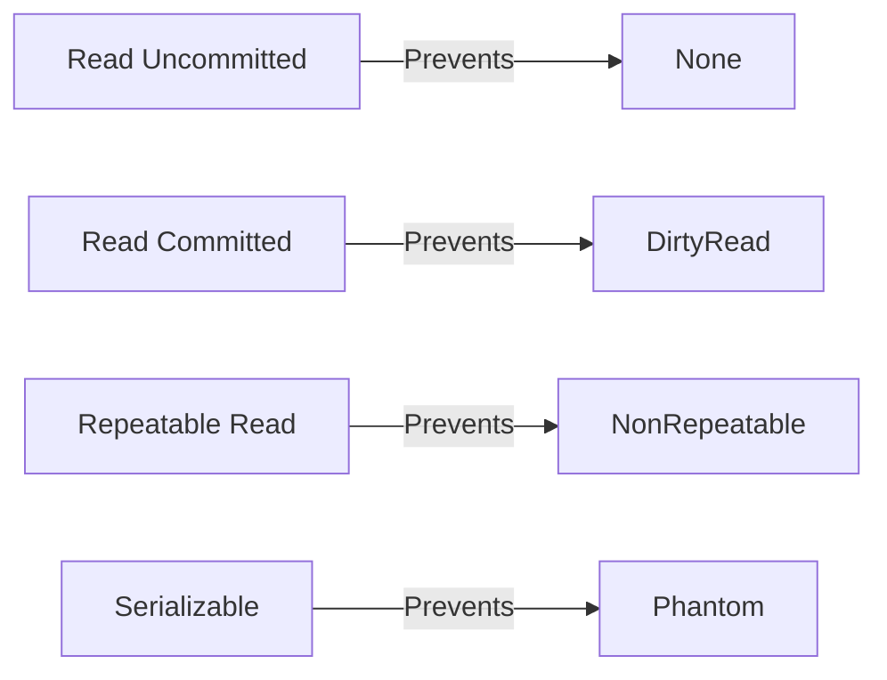

---
---

## Summary
**Transactions** are units of work representing a sequence of operations that must succeed or fail as a whole. They are the mechanism that enforces ACID properties. A key concept in transactions is the **Isolation Level**, which determines how visible changes are to other concurrent transactions.

## Detailed Explanation
### Isolation Levels (ANSI SQL Standard)
Ordered from weakest (fastest) to strongest (slowest/safest):
1.  **Read Uncommitted**: Can read uncommitted data ("Dirty Read"). Safe from nothing.
2.  **Read Committed**: Can only read committed data. Prevents Dirty Reads. (Default in Postgres, SQL Server, Oracle).
3.  **Repeatable Read**: Ensures that if you read a row once, you see the same data if you read it again. Prevents Dirty Reads and Non-Repeatable Reads. (Default in MySQL).
4.  **Serializable**: Strict execution. Transactions run as if one after another. Prevents all anomalies including Phantom Reads.

### Concurrency Anomalies
*   **Dirty Read**: Reading data that another transaction wrote but rolled back.
*   **Non-Repeatable Read**: Reading a row, then someone updates it, then reading it again and getting different values.
*   **Phantom Read**: Reading a set of rows (range), then someone inserts a new row in that range, and you see it in a re-read.

### Go Context
Setting Isolation Levels in Go:

```go
package main

import (
	"context"
	"database/sql"
)

func runTx(db *sql.DB) {
	ctx := context.Background()
	opts := &sql.TxOptions{
		Isolation: sql.LevelSerializable, // Strict Isolation
		ReadOnly:  false,
	}

	tx, _ := db.BeginTx(ctx, opts)
	defer tx.Rollback()

	// Operations...
	
	tx.Commit()
}
```

## Interview Questions
**Q: What is the default isolation level in PostgreSQL vs MySQL?**
A: PostgreSQL defaults to **Read Committed**. MySQL (InnoDB) defaults to **Repeatable Read**.

**Q: Why not always use Serializable?**
A: Performance. Serializable often requires aggressive locking or transaction aborts (serialization failures), drastically reducing throughput in high-concurrency systems.

**Q: What is a Phantom Read?**
A: A phenomenon where a transaction re-executes a query returning a set of rows that satisfy a search condition and finds that the set of rows satisfying the condition has changed due to another recently-committed transaction (e.g., a new row appeared).

## Diagram

