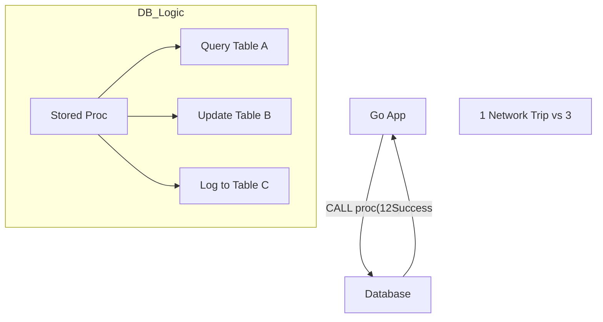

---
---

## Summary
**Stored Procedures** are code (SQL + procedural logic) saved inside the database. They can encapsulate logic, enforce security, and improve performance by reducing network round-trips. However, they can be hard to debug, version control, and migrate.

## Detailed Explanation
### Components
*   **Parameters**: IN, OUT, INOUT.
*   **Logic**: Variables, IF/ELSE, LOOPS, Cursors.
*   **Functions vs Procedures**: Functions return a value and can be used in SQL (`SELECT my_func()`). Procedures are called (`CALL my_proc()`) and often perform actions.

### Pros & Cons
| Pros | Cons |
| :--- | :--- |
| **Performance**: Pre-compiled, runs close to data. | **Maintenance**: Hard to debug/test. |
| **Security**: Grant exec permission, hide table access. | **Portability**: Vendor lock-in (PL/SQL vs T-SQL). |
| **Network**: One call triggers many ops. | **Scalability**: DB CPU is harder to scale than App CPU. |

### Go Context
In Go, avoid putting *business logic* in Stored Procedures ("Logic Leak"). Use them only for data-intensive operations.

```go
package main

import "database/sql"

func callProc(db *sql.DB, userID int) {
	// Calling a Stored Procedure
	_, err := db.Exec("CALL recalculate_user_balance($1)", userID)
	if err != nil {
		// Handle error
	}
}
```

## Interview Questions
**Q: Why might a modern startup avoid Stored Procedures?**
A: They make the database a "monolith" of logic. It's harder to scale the database than the application tier. Also, version control and CI/CD for DB code are generally more painful than for Go/Java/Python code.

**Q: What is the difference between a Stored Procedure and a Function?**
A: A Function must return a value and can be used inside a SELECT statement. A Procedure does not strictly need to return a value (though it can use OUT params) and is invoked via CALL/EXECUTE. Procedures can often manage transactions; functions usually cannot.

## Diagram

