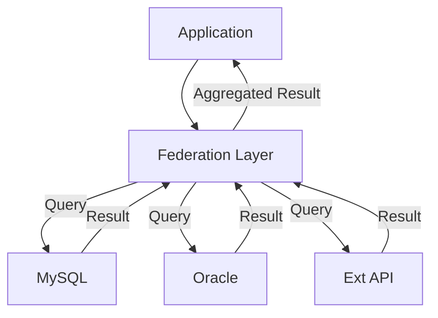

---
---

## Summary
**Database Federation** is a software architecture that maps multiple distinct, autonomous databases into a single federated database. This creates a "Virtual Database" that allows applications to query data from various sources (SQL, NoSQL, APIs) as if they were a single entity, without actually moving the data.

## Detailed Explanation
### Concept
Instead of ETL (Extract, Transform, Load) where data is copied into a warehouse, Federation queries data *where it lives*.
*   **Wrapper**: A software component that translates the federated query into the native query language of the source.
*   **Middleware**: The federation engine that decomposes the query, sends sub-queries, and aggregates results.

### Use Cases
*   **Legacy Integration**: Querying old Mainframe data alongside new Cloud SQL data.
*   **Regulatory Compliance**: Leaving data in a specific region/DB but querying it globally.

### Go Context
In a Go microservices architecture, you might implement "Application-Level Federation" (API Gateway or GraphQL Federation) rather than DB-level federation.
*   **GraphQL Federation**: The "Federated DB" is actually a Graph of Services.

## Interview Questions
**Q: What is the performance downside of Database Federation?**
A: Latency. A query is only as fast as the slowest data source. Also, joins across networks are extremely expensive (requires moving large datasets to the federation engine to join).

**Q: Difference between Data Warehouse and Data Federation?**
A: Warehouse copies data (physically centralized). Federation accesses data in place (logically centralized).

## Diagram

