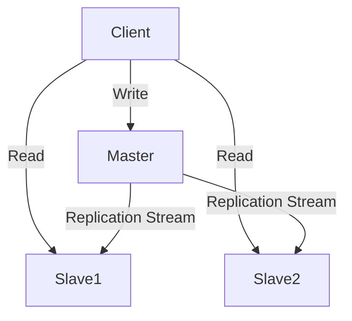

---
---

## Summary
**Replication** is the process of copying data from one database node to another. It provides **Redundancy** (backup/failover) and **Performance** (scaling reads). The most common pattern is **Leader-Follower** (Master-Slave), where writes go to one node and are copied to others.

## Detailed Explanation
### Replication Models
1.  **Single Leader (Master-Slave)**:
    *   Writes $\to$ Leader.
    *   Reads $\to$ Leader or Followers.
    *   **Pros**: Simple, consistent writes. **Cons**: Leader is write bottleneck.
2.  **Multi-Leader (Master-Master)**:
    *   Writes $\to$ Any Leader.
    *   **Pros**: High write availability, geo-distributed writes. **Cons**: Conflict resolution (User A updates X on Node 1, User B updates X on Node 2).
3.  **Leaderless**:
    *   Writes $\to$ Quorum of nodes (e.g., Cassandra).

### Sync vs Async
*   **Synchronous**: Leader waits for Follower to acknowledge before confirming write. (Safe, but slow).
*   **Asynchronous**: Leader confirms write immediately. Follower catches up later. (Fast, but risk of data loss on crash).

### Go Context
Connecting to a replicated setup in Go usually involves configuring separate connection pools.

```go
package main

import (
	"database/sql"
)

type DBCluster struct {
	Primary  *sql.DB
	Replicas []*sql.DB
}

// Simple Round-Robin for reads
func (c *DBCluster) GetReadDB() *sql.DB {
	// Implementation to pick a replica
	return c.Replicas[0] 
}

func main() {
	// Write: Always use Primary
	// cluster.Primary.Exec("INSERT ...")
	
	// Read: Use Replica
	// cluster.GetReadDB().Query("SELECT ...")
}
```

## Interview Questions
**Q: What is Replication Lag?**
A: The time delay between a write happening on the Leader and it appearing on the Follower. In Async replication, this is non-zero. It causes "Eventual Consistency" issues where a user posts a comment but doesn't see it immediately.

**Q: How do you handle Read-After-Write consistency?**
A: If a user writes data, enforce reading *that* data from the Leader (or pin their session to the Leader) for a short time, while letting other queries go to replicas.

## Diagram

