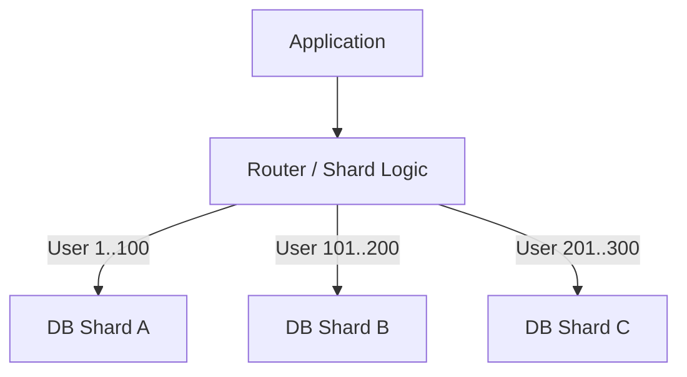

---
---

## Summary
**Sharding** (Horizontal Partitioning) is the process of splitting a large dataset across multiple database instances (shards) based on a **Shard Key**. Unlike replication (which copies data), sharding splits data. It is used when a single server cannot handle the total storage or write throughput.

## Detailed Explanation
### How it Works
1.  **Shard Key**: The column determines which shard a row belongs to (e.g., `user_id`).
2.  **Routing**: The application or a proxy calculates `ShardID = hash(user_id) % NumShards` and directs the query.

### Challenges
*   **Rebalancing**: Adding a new shard requires moving data (expensive). **Consistent Hashing** mitigates this.
*   **Cross-Shard Joins**: Very expensive or impossible. Queries should ideally hit only one shard.
*   **Hot Keys**: If one user (e.g., Justin Bieber) gets 90% of traffic, that shard melts down.

### Go Context
Sharding logic often lives in the application layer in Go if the DB doesn't support it natively (like MySQL).

```go
package main

import "hash/fnv"

func getShardID(userID string, numShards int) int {
	h := fnv.New32a()
	h.Write([]byte(userID))
	return int(h.Sum32()) % numShards
}

// Use shardID to pick the correct db connection from a map
```

## Interview Questions
**Q: Difference between Sharding and Partitioning?**
A: **Partitioning** usually refers to splitting a table *within* the same database instance (e.g., by date). **Sharding** distributes those partitions across *different* physical servers.

**Q: What is a "Scatter-Gather" query?**
A: A query that doesn't include the shard key. The system must send the query to *all* shards, wait for results, and aggregate them. It is slow and efficient.

**Q: How does Consistent Hashing help in Sharding?**
A: In modular hashing (`% N`), changing N (adding a node) remaps almost all keys. In Consistent Hashing, adding a node only remaps $1/N$ keys, minimizing data movement.

## Diagram

