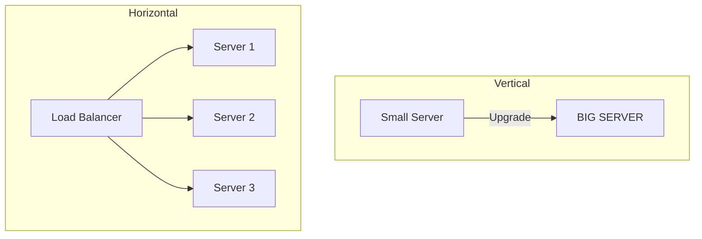

---
---

## Summary
**Scaling** is the ability of a system to handle growing amounts of work. **Horizontal Scaling (Scale-Out)** means adding more machines to the resource pool. **Vertical Scaling (Scale-Up)** means adding more power (CPU, RAM) to an existing machine.

## Detailed Explanation
### Vertical Scaling (Scale-Up)
*   **Concept**: Buy a bigger server. Upgrade from 4GB RAM to 64GB RAM.
*   **Pros**: Simple. No code changes required.
*   **Cons**: Hard limit (cannot upgrade infinitely). Single point of failure. Expensive (high-end hardware has diminishing returns).
*   **Use Case**: Initial stages, small databases.

### Horizontal Scaling (Scale-Out)
*   **Concept**: Buy more servers. Add 10 more t2.micro instances.
*   **Pros**: Infinite theoretical scale. Fault tolerance (one node dies, others survive). Cost-effective (commodity hardware).
*   **Cons**: Complex. Requires Load Balancer. Distributed systems issues (data consistency, CAP theorem).
*   **Use Case**: Web servers, large distributed databases (Cassandra, MongoDB).

### Go Context
Go is designed for **Horizontal Scaling**. Its lightweight Goroutines allow a single instance to handle thousands of concurrent connections (efficient Vertical usage), but its stateless nature makes it perfect for running behind a Load Balancer in a horizontally scaled Kubernetes cluster.

## Interview Questions
**Q: When is Vertical Scaling better than Horizontal?**
A: When the application is stateful and difficult to distribute (e.g., a legacy SQL database without sharding support), or when the traffic increase is small/temporary and refactoring for distributed scale is overkill.

**Q: What is the main bottleneck in Horizontal Scaling?**
A: The Database. You can easily scale stateless web servers horizontally, but eventually, they all hit the single primary database. You then need to implement Database Sharding or Read Replicas.

## Diagram

