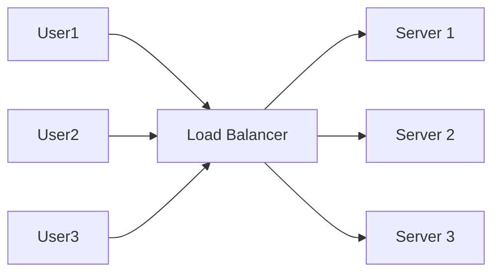

---
---

## Summary
**Load Balancing** is the process of distributing network traffic across multiple servers to ensure no single server bears too much demand. It improves application responsiveness and increases availability. Load Balancers (LBs) can operate at Layer 4 (Transport) or Layer 7 (Application).

## Detailed Explanation
### Types
1.  **Layer 4 (L4)**: Balances based on IP and Port. Fast, but "dumb". Doesn't inspect content. (e.g., TCP Load Balancer).
2.  **Layer 7 (L7)**: Balances based on Content (URL, Cookies, Headers). Slower, but "smart". Can route `/api` to Svc-A and `/images` to Svc-B. (e.g., Nginx, HAProxy, AWS ALB).

### Algorithms
*   **Round Robin**: Sequential (A -> B -> C -> A).
*   **Least Connections**: Send to server with fewest active connections.
*   **IP Hash**: Hash the client IP to ensure a user always hits the same server (Sticky Sessions).

### Go Context
Go can act as a simple Load Balancer using `httputil.ReverseProxy`.

```go
package main

import (
	"log"
	"net/http"
	"net/http/httputil"
	"net/url"
)

func main() {
	// Simple Round Robin Load Balancer
	targets := []string{"http://localhost:8081", "http://localhost:8082"}
	var current int

	http.HandleFunc("/", func(w http.ResponseWriter, r *http.Request) {
		targetURL, _ := url.Parse(targets[current])
		current = (current + 1) % len(targets) // Round Robin

		proxy := httputil.NewSingleHostReverseProxy(targetURL)
		proxy.ServeHTTP(w, r)
	})

	log.Fatal(http.ListenAndServe(":8080", nil))
}
```

## Interview Questions
**Q: How do you handle Session Persistence (Sticky Sessions) in a Load Balancer?**
A: Use IP Hashing or inject a specific Cookie that the LB reads to route the user back to the same server. Note: This makes horizontal scaling harder (if that server dies, session is lost).

**Q: What is the difference between L4 and L7 balancing?**
A: L4 operates at the TCP/UDP level (IP:Port), it's faster but less flexible. L7 operates at HTTP level, allowing routing based on URL path, headers, or cookies, but requires decrypting HTTPS (SSL Termination).

## Diagram

