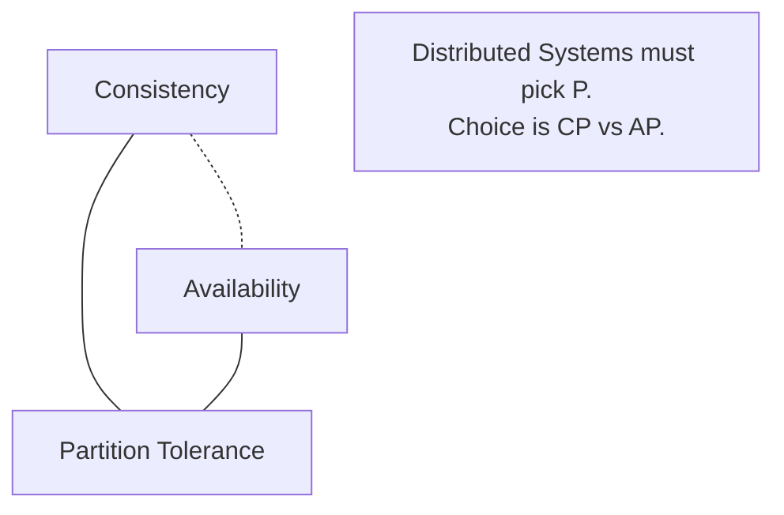

---
---

## Summary
The **CAP Theorem** in System Design dictates that a distributed system can only provide two of three guarantees: **Consistency** (all nodes see the same data), **Availability** (every request gets a response), and **Partition Tolerance** (system survives network cuts). In distributed systems, P is unavoidable, so we must choose between **CP** (Consistency) and **AP** (Availability).

## Detailed Explanation
### Trade-off
*   **CP (Consistency + Partition Tolerance)**: If a partition happens, the system rejects writes to prevent data divergence.
    *   *Example*: Banking system. Better to say "System Error" than show wrong balance.
    *   *Tech*: HBase, MongoDB, Redis (default).
*   **AP (Availability + Partition Tolerance)**: If a partition happens, the system accepts writes on all nodes, even if they drift apart. They sync later (Eventual Consistency).
    *   *Example*: Social Media feed. Better to show old posts than a blank page.
    *   *Tech*: Cassandra, DynamoDB, CouchDB.

### Go Context
When designing Go microservices:
*   Use **AP** patterns (Retries, Saga Pattern) for high uptime services.
*   Use **CP** patterns (Distributed Locks, Two-Phase Commit) for financial/critical services.

## Interview Questions
**Q: Why is "CA" not a real option for distributed systems?**
A: CA implies the system is Consistent and Available but NOT Partition Tolerant. This means if a network cable is cut, the system fails completely. In any networked system, partitions *will* happen, so P must be supported. CA is only possible in a single-node monolith.

**Q: What is PACELC?**
A: An extension of CAP. "If Partition (P), trade A vs C. Else (E), trade Latency (L) vs Consistency (C)". It acknowledges that even without partitions, strong consistency implies higher latency (replication time).

## Diagram

