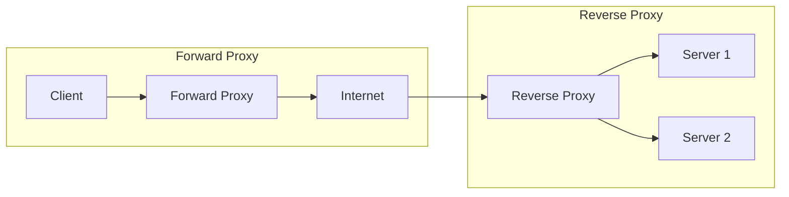

---
---

## Summary
A **Proxy** acts as an intermediary. A **Forward Proxy** sits before the Client (protecting/anonymizing the client). A **Reverse Proxy** sits before the Server (protecting/load-balancing the server).

## Detailed Explanation
### Forward Proxy
*   **Client Side**.
*   **Use Cases**: VPN, Content Filtering (School/Corporate firewall blocking Facebook), Anonymity.
*   *Server sees the Proxy's IP, not the Client's.*

### Reverse Proxy
*   **Server Side**.
*   **Use Cases**: Load Balancing, SSL Termination, Caching, DDoS Protection, Hiding Origin IP.
*   *Client sees the Proxy's IP, not the Origin Server's.*
*   Examples: Nginx, HAProxy, Envoy, AWS CloudFront.

### Go Context
Go is excellent for building custom proxies.

```go
package main

import (
	"log"
	"net/http"
	"net/http/httputil"
	"net/url"
)

func main() {
	// Simple Reverse Proxy to Google
	target, _ := url.Parse("https://www.google.com")
	proxy := httputil.NewSingleHostReverseProxy(target)

	http.ListenAndServe(":8080", proxy)
}
```

## Interview Questions
**Q: What is SSL Termination?**
A: The Reverse Proxy handles the decryption of incoming HTTPS connections. The traffic between the Proxy and the Internal App Servers is then sent over plain HTTP (faster, simpler). This offloads CPU-intensive encryption work from the app servers.

**Q: Can a Reverse Proxy act as a Load Balancer?**
A: Yes, most reverse proxies (Nginx, HAProxy) include load balancing features.

## Diagram

