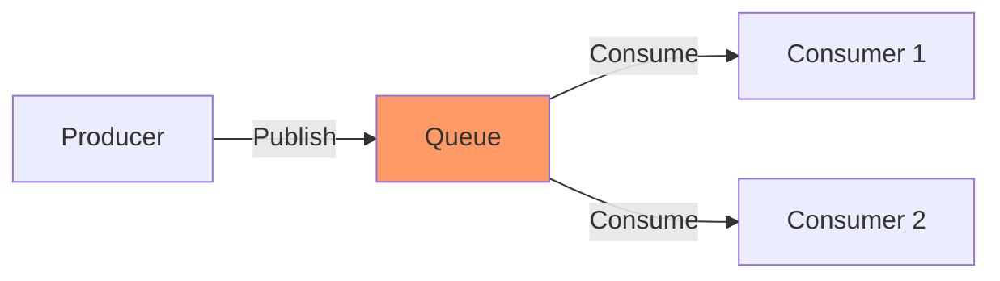

---
---

## Summary
**Message Queues** are asynchronous communication buffers used to decouple components of a system. A Producer sends a message to the Queue, and a Consumer reads it when ready. This enables **Asynchronous Processing**, **Throttling/Backpressure**, and **Reliability**.

## Detailed Explanation
### Key Concepts
1.  **Decoupling**: Producer doesn't need to know who (or if anyone) is listening.
2.  **Backpressure**: If consumers are slow, messages pile up in the queue instead of crashing the producer.
3.  **Persistence**: Durable queues save messages to disk, ensuring no data loss if the broker crashes.

### Technologies
*   **RabbitMQ**: General purpose, rich routing, pub/sub.
*   **Kafka**: High throughput log streaming, persistent, replayable.
*   **AWS SQS**: Simple, managed cloud queue.

### Go Context
Go's concurrency model (Channels) is essentially an in-memory queue. For distributed systems, we use libraries.

```go
package main

// Concept: Using a Go Channel as a local queue
func main() {
	queue := make(chan string, 100) // Buffer size 100

	// Producer
	go func() {
		queue <- "Task 1"
	}()

	// Consumer
	go func() {
		task := <-queue
		process(task)
	}()
}
```

## Interview Questions
**Q: Push vs Pull model in Queues?**
A: 
*   **Push**: Broker pushes messages to Consumer (e.g., RabbitMQ). Low latency, but can overwhelm consumer.
*   **Pull**: Consumer polls Broker (e.g., Kafka, SQS). Consumer controls the rate, but higher latency.

**Q: What happens if a consumer crashes while processing a message?**
A: Ideally, the system uses **Ack/Nack**. The message is only removed from the queue after the consumer sends an ACK. If it crashes (no ACK), the queue makes the message visible to other consumers again (Visibility Timeout).

## Diagram

