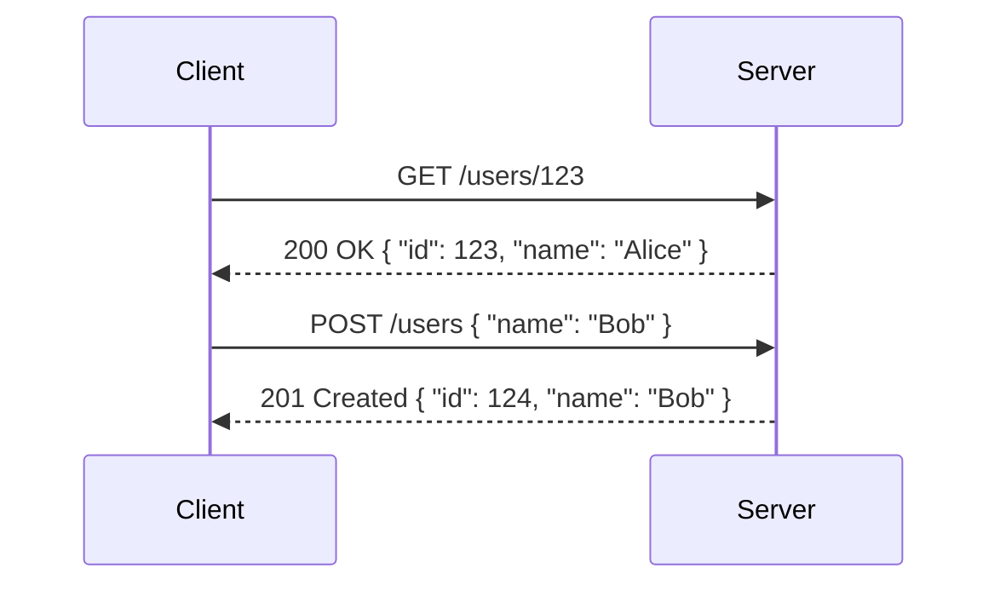

---
---

## Summary
**REST (Representational State Transfer)** is an architectural style for designing networked applications. It treats data as **Resources** (identified by URLs) and uses standard HTTP methods (GET, POST, PUT, DELETE) to manipulate them. It is stateless, cacheable, and uniform.

## Detailed Explanation
### Key Constraints
1.  **Stateless**: Server stores no client context between requests. Every request must contain all info needed (Auth tokens, etc.).
2.  **Client-Server**: Decoupled.
3.  **Cacheable**: Responses must define if they can be cached.
4.  **Uniform Interface**: Consistent URL patterns (`/users`, `/users/{id}`).

### Richardson Maturity Model
*   **Level 0**: The Swamp of POX (Plain Old XML). Using HTTP just as a transport.
*   **Level 1**: Resources. Using `/users/1` instead of `/api?action=getUser&id=1`.
*   **Level 2**: HTTP Verbs. Using GET for read, DELETE for delete (instead of POST for everything).
*   **Level 3**: **HATEOAS** (Hypermedia As The Engine Of Application State). Responses include links to next possible actions.

### Go Context
Go's standard `net/http` or frameworks like `Gin` / `Echo`.

```go
package main

import (
	"encoding/json"
	"net/http"
)

type User struct {
	ID   int    `json:"id"`
	Name string `json:"name"`
}

func getUser(w http.ResponseWriter, r *http.Request) {
	// REST Level 2: Using GET verb and Resource URL
	user := User{ID: 1, Name: "Alice"}
	w.Header().Set("Content-Type", "application/json")
	json.NewEncoder(w).Encode(user)
}

func main() {
	http.HandleFunc("/users/1", getUser)
	http.ListenAndServe(":8080", nil)
}
```

## Interview Questions
**Q: Is REST a protocol?**
A: No, it's an architectural style. HTTP is the protocol it typically uses.

**Q: What is HATEOAS?**
A: It means the API response includes navigation links. Example: fetching a user returns the user data PLUS a link to ` "orders": "/users/1/orders" `. It allows the client to discover the API dynamically.

**Q: POST vs PUT?**
A: POST creates a new resource (usually server assigns ID). PUT replaces/updates a specific resource (client knows the ID). PUT is idempotent; POST is not.

## Diagram

