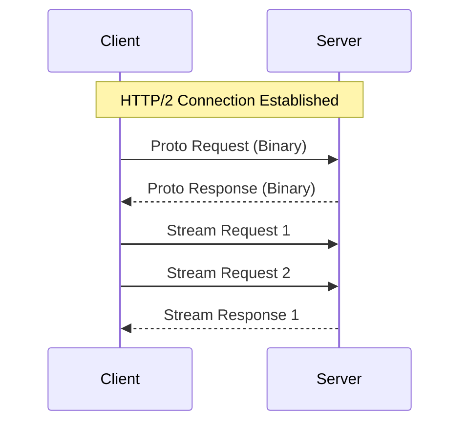

---
---

## Summary
**gRPC (gRPC Remote Procedure Call)** is a high-performance open-source framework developed by Google. It uses **HTTP/2** for transport and **Protocol Buffers (Protobuf)** as the interface description language and binary serialization format. It is ideal for internal microservices communication.

## Detailed Explanation
### Key Features
1.  **Binary Protocol**: Protobuf is binary, smaller, and faster to serialize/deserialize than JSON.
2.  **HTTP/2**: Supports Multiplexing, Header Compression, and Streaming.
3.  **Streaming**:
    *   **Unary**: Simple Req/Res.
    *   **Server Streaming**: 1 Req -> Many Res.
    *   **Client Streaming**: Many Req -> 1 Res.
    *   **Bi-Directional**: Many Req <-> Many Res.
4.  **Strict Contracts**: `.proto` files define the API strict schema.

### Go Context
Go has excellent gRPC support (`google.golang.org/grpc`). You define service in `.proto`, generate Go code, and implement the interface.

```protobuf
// service.proto
service Greeter {
  rpc SayHello (HelloRequest) returns (HelloReply) {}
}

message HelloRequest { string name = 1; }
message HelloReply { string message = 1; }
```

## Interview Questions
**Q: Why is gRPC faster than REST?**
A: 
1.  **Protobuf**: Binary serialization is much smaller/faster than JSON text parsing.
2.  **HTTP/2**: Multiplexing allows multiple calls over one TCP connection (no head-of-line blocking).
3.  **Strong Typing**: Code generation avoids runtime reflection overhead.

**Q: Can browsers call gRPC directly?**
A: No, browsers don't expose the HTTP/2 frames control required for gRPC. You need **gRPC-Web** (a proxy) to translate.

## Diagram

