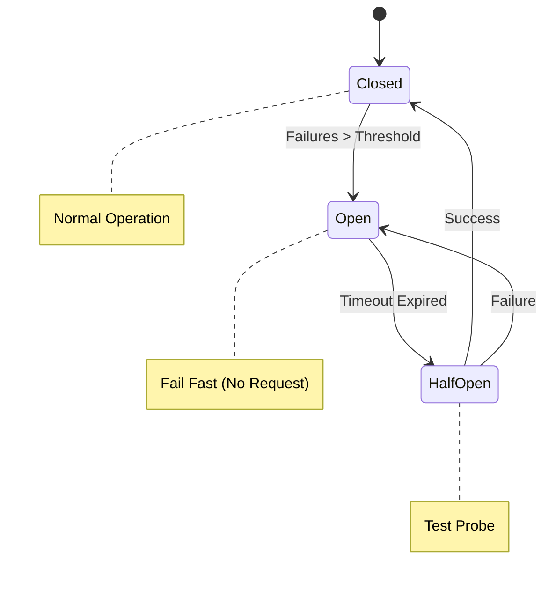

---
---

## Summary
**Cloud Design Patterns** are proven solutions to common problems in distributed systems, focusing on reliability, scalability, and security.

## Detailed Explanation
### Key Patterns
1.  **Circuit Breaker**: Prevents an application from repeatedly trying to execute an operation that's likely to fail (e.g., calling a down service). It "trips" after X failures, returning errors immediately for a cooldown period.
2.  **Bulkhead**: Isolates elements into pools so if one fails, the others continue to function (like ship bulkheads). (e.g., Separate connection pools for Service A and Service B).
3.  **Sidecar**: Deploys helper components alongside the main container (e.g., Logging agent, Proxy like Envoy).
4.  **Ambassador**: A proxy service that handles network calls on behalf of the consumer (e.g., Retry logic, Monitoring).
5.  **Backoff & Retry**: Waiting exponentially longer between retries to avoid overwhelming a recovering service (`1s -> 2s -> 4s`).

### Go Context
Using the **Circuit Breaker** pattern in Go:

```go
package main

import (
	"fmt"
	"github.com/sony/gobreaker"
	"net/http"
	"time"
)

func main() {
	cb := gobreaker.NewCircuitBreaker(gobreaker.Settings{
		Name:    "HTTP Client",
		Timeout: 5 * time.Second,
		ReadyToTrip: func(counts gobreaker.Counts) bool {
			return counts.ConsecutiveFailures > 3
		},
	})

	_, err := cb.Execute(func() (interface{}, error) {
		resp, err := http.Get("http://example.com")
		if err != nil {
			return nil, err
		}
		return resp, nil
	})

	if err != nil {
		fmt.Println("Request failed or Breaker Open:", err)
	}
}
```

## Interview Questions
**Q: Why use Exponential Backoff?**
A: If a service is overloaded, retrying immediately just adds more load, preventing it from recovering. Exponential backoff gives the service breathing room to recover.

**Q: Explain the Bulkhead pattern.**
A: It's about fault isolation. If your API calls Service A (slow) and Service B (fast), and they share the same thread pool, Service A will exhaust all threads, killing Service B too. Separate pools (bulkheads) prevent this.

## Diagram

