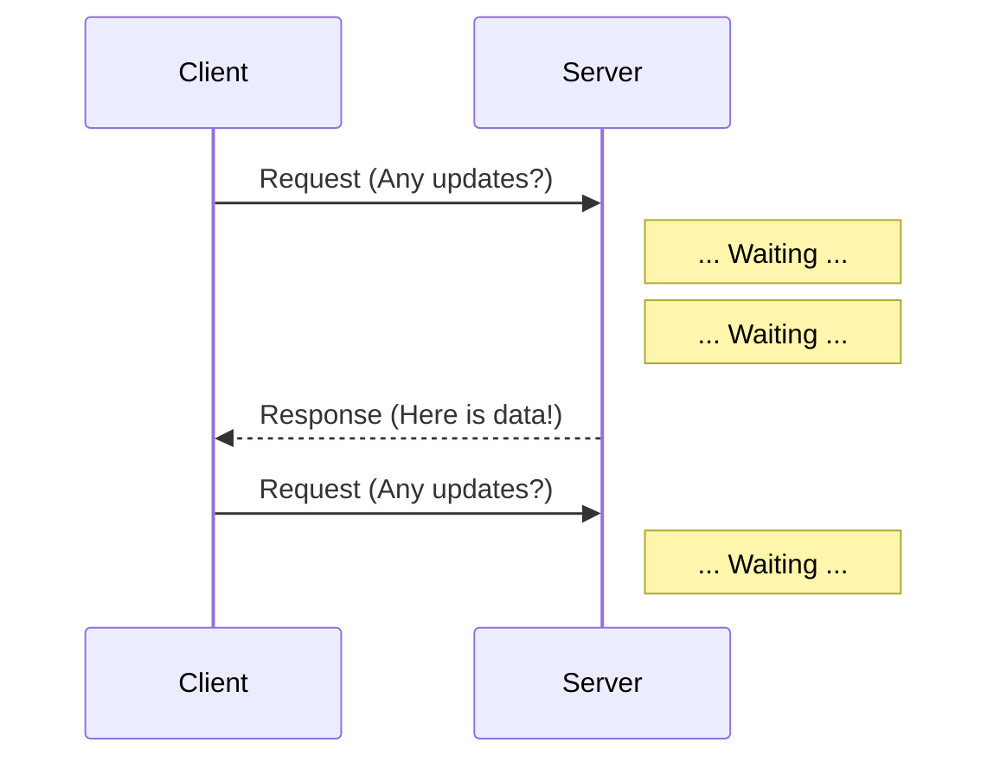

---
---

## Summary
**Long Polling** is a technique to emulate a server push. The client sends a request, and the server **holds** the connection open until new data is available (or timeout). Once data arrives, the server responds, and the client immediately sends a new request.

## Detailed Explanation
### How it Works
1.  **Request**: Client asks "Any new messages?"
2.  **Wait**: Server does *not* reply immediately. It waits/blocks until a message arrives.
3.  **Response**: Server sends message. Connection closes.
4.  **Repeat**: Client processes message and *immediately* opens a new request.

### Pros & Cons
*   **Pros**: Near real-time. Works in all browsers. No special protocol (just HTTP).
*   **Cons**: Server holds many idle connections (resource intensive). Header overhead (request headers sent every time).

### Go Context
In Go, you block the Goroutine using a channel select or context timeout.

```go
func longPollHandler(w http.ResponseWriter, r *http.Request) {
    // Wait for new data OR timeout
    select {
    case data := <-messageChannel:
        json.NewEncoder(w).Encode(data)
    case <-time.After(30 * time.Second):
        w.WriteHeader(http.StatusNoContent) // Timeout
    case <-r.Context().Done():
        return // Client disconnected
    }
}
```

## Interview Questions
**Q: Why is Long Polling better than Short Polling?**
A: Lower latency (client gets data instantly when it arrives) and less wasted bandwidth (fewer empty responses), though it consumes more server connection slots.

**Q: What happens if the client disconnects during the wait?**
A: The server detects the closed connection (via `r.Context().Done()` in Go) and should clean up resources.

## Diagram

