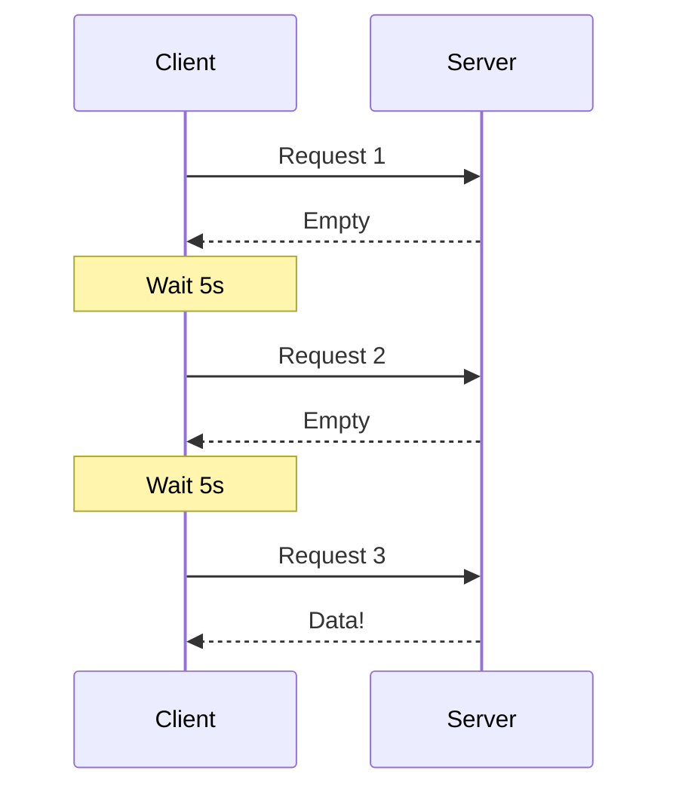

---
---

## Summary
**Short Polling** is the simplest way to check for updates. The client sends a request to the server at fixed intervals (e.g., every 5 seconds) to ask "Do you have new data?".

## Detailed Explanation
### How it Works
1.  Client sends AJAX request.
2.  Server checks DB.
3.  Server responds immediately (Data or "No updates").
4.  Client waits X seconds.
5.  Repeat.

### Pros & Cons
*   **Pros**: Easiest to implement. Stateless server.
*   **Cons**: High Latency (up to the poll interval). Wasted resources (most requests return empty). Bandwidth heavy (headers sent repeatedly).

### Go Context
Simple standard HTTP handler.

```go
func pollHandler(w http.ResponseWriter, r *http.Request) {
    // Check DB immediately
    data := getDataFromDB()
    json.NewEncoder(w).Encode(data)
}
```
*Client Side (JS)*: `setInterval(fetchData, 5000);`

## Interview Questions
**Q: When is Short Polling actually a good choice?**
A: When data updates rarely (e.g., checking for a software update once a day) or when real-time latency doesn't matter and simplicity is key.

**Q: Short Polling vs Long Polling?**
A: Use Short Polling for low-frequency updates. Use Long Polling for near-real-time requirements if WebSockets are not an option.

## Diagram

