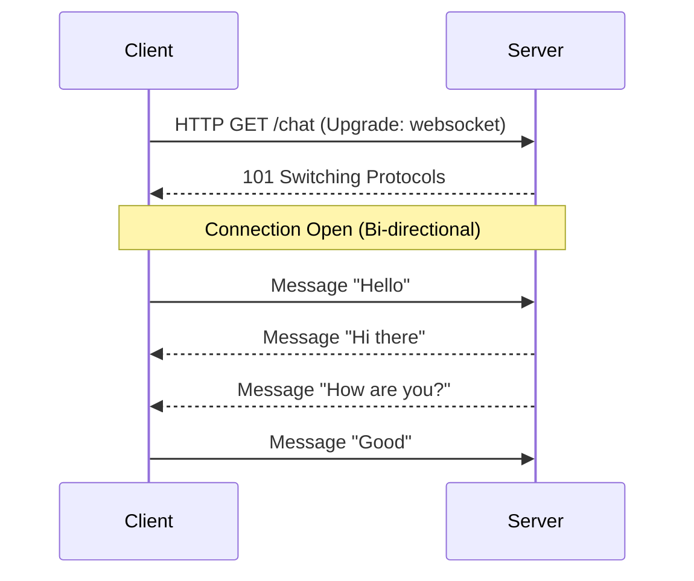

---
---

## Summary
**WebSockets** provide a persistent, full-duplex communication channel over a single TCP connection. Unlike HTTP (Req-Res), either the client or server can send data at any time. Ideal for chat apps, gaming, and trading platforms.

## Detailed Explanation
### The Protocol
1.  **Handshake**: Starts as a normal HTTP Request with `Upgrade: websocket`.
2.  **Upgrade**: Server replies `101 Switching Protocols`.
3.  **Connection**: The TCP connection remains open. Data is exchanged in **Frames** (Binary or Text). Low overhead (no HTTP headers per message).

### Pros & Cons
*   **Pros**: Real-time, bi-directional, low overhead.
*   **Cons**: Stateful (server must maintain connection). Harder to scale (requires sticky sessions or a pub/sub backend like Redis to sync messages across servers).

### Go Context
Using `gorilla/websocket` (Standard choice):

```go
var upgrader = websocket.Upgrader{} // Configures buffers/check origin

func wsHandler(w http.ResponseWriter, r *http.Request) {
    conn, _ := upgrader.Upgrade(w, r, nil) // Upgrade HTTP to WS
    defer conn.Close()

    for {
        // Read
        _, msg, err := conn.ReadMessage()
        if err != nil { break }
        
        // Write (Echo)
        conn.WriteMessage(websocket.TextMessage, msg)
    }
}
```

## Interview Questions
**Q: How do you scale WebSockets horizontally?**
A: Since connections are stateful, User A might be on Server 1 and User B on Server 2. If A sends a message to B, Server 1 doesn't know about B. You need a **Pub/Sub** system (like Redis) so Server 1 can publish the message, and Server 2 (subscribed) receives it and pushes it to User B.

**Q: WebSockets vs Long Polling?**
A: WebSockets have much lower overhead (no headers per message) and lower latency. Use WS for high-frequency, two-way data. Use Long Polling if WS is blocked by corporate firewalls (fallback).

## Diagram

