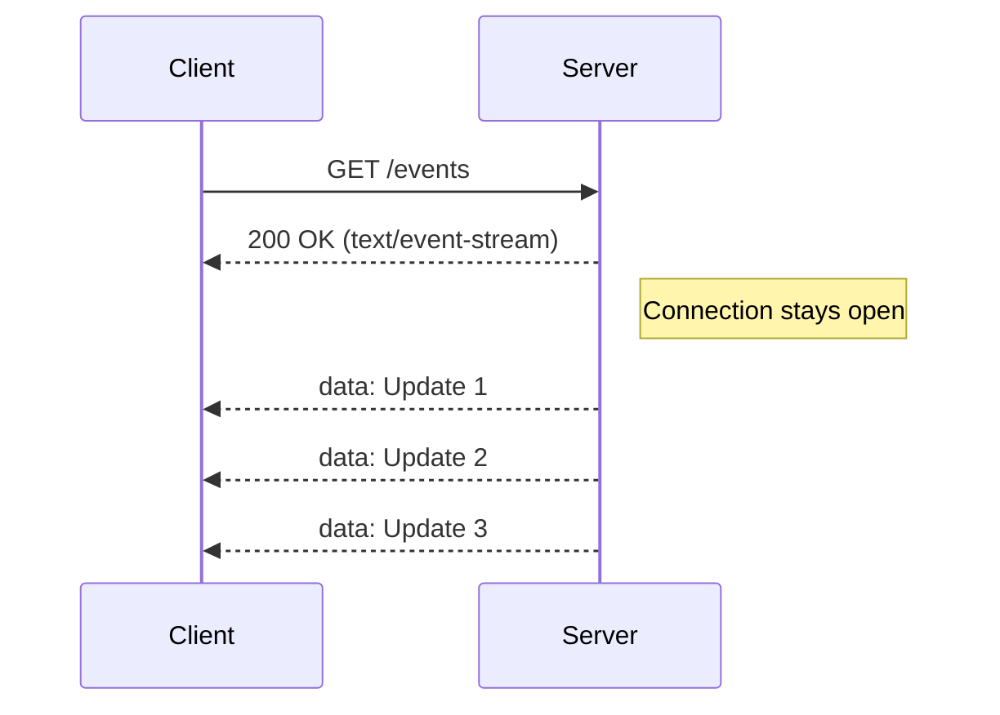

---
---

## Summary
**SSE (Server-Sent Events)** allows a server to push data to the client over a standard HTTP connection. Unlike WebSockets, it is **One-Way** (Server $\to$ Client) and text-only. Ideal for news feeds, stock tickers, or logs.

## Detailed Explanation
### How it Works
1.  Client sends normal HTTP request.
2.  Server keeps connection open and sends response with `Content-Type: text/event-stream`.
3.  Server pushes lines of text starting with `data:`.
4.  Browser API (`EventSource`) automatically handles reconnection.

### Pros & Cons
*   **Pros**: Simple (standard HTTP), built-in reconnection, works well with firewalls/proxies.
*   **Cons**: One-way only. Text only (no binary). Browser limit (HTTP/1.1 limits to ~6 connections per domain; HTTP/2 fixes this).

### Go Context
Simple to implement with standard `net/http` and `Flusher`.

```go
func sseHandler(w http.ResponseWriter, r *http.Request) {
    w.Header().Set("Content-Type", "text/event-stream")
    w.Header().Set("Cache-Control", "no-cache")
    w.Header().Set("Connection", "keep-alive")

    flusher, _ := w.(http.Flusher)

    for {
        fmt.Fprintf(w, "data: The time is %s\n\n", time.Now().String())
        flusher.Flush() // Send immediately
        time.Sleep(1 * time.Second)
    }
}
```

## Interview Questions
**Q: When would you use SSE over WebSockets?**
A: When you only need one-way communication (e.g., live sports score updates). SSE is simpler, lighter, and works over standard HTTP without custom protocols.

**Q: Does SSE support binary data?**
A: No, it is strictly text-based (UTF-8). You would need to Base64 encode binary data, which increases size by ~33%.

## Diagram

