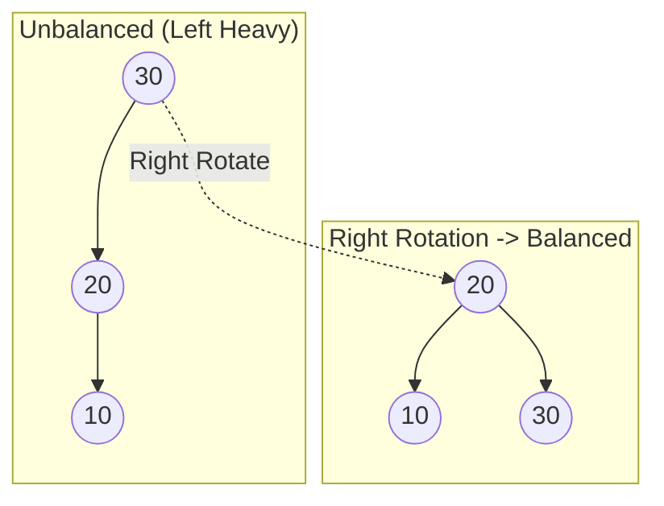

---
---

## Summary
**AVL Trees** (named after inventors Adelson-Velsky and Landis) are **self-balancing Binary Search Trees (BST)** where the difference between the heights of left and right subtrees cannot be more than one for all nodes. This strict balancing ensures $O(\log n)$ time complexity for search, insert, and delete operations.

## Detailed Explanation
### The Balance Factor
The core property of an AVL tree is the **Balance Factor (BF)**:
$$ BF(node) = Height(LeftSubtree) - Height(RightSubtree) $$
For an AVL tree, $BF(node) \in \{-1, 0, 1\}$. If $|BF| > 1$, the tree is unbalanced and requires rebalancing.

### Rotations
Rebalancing is performed via **Rotations**.
1.  **Right Rotation (LL Case)**: When the left child's left subtree is too heavy.
2.  **Left Rotation (RR Case)**: When the right child's right subtree is too heavy.
3.  **Left-Right Rotation (LR Case)**: Left child is heavy, but *its* right child is the cause. Rotate Left then Right.
4.  **Right-Left Rotation (RL Case)**: Right child is heavy, but *its* left child is the cause. Rotate Right then Left.

### Complexity
*   **Search**: $O(\log n)$
*   **Insert/Delete**: $O(\log n)$ (due to rebalancing)
*   **Space**: $O(n)$

### Go Context
AVL trees are rarely used in standard libraries (Red-Black is preferred due to fewer rotations on delete). In Go, you would implement it manually if strict lookup speed is critical.

```go
package main

import "fmt"

type Node struct {
	Key    int
	Height int
	Left   *Node
	Right  *Node
}

// Get height of a node (handles nil)
func height(n *Node) int {
	if n == nil {
		return 0
	}
	return n.Height
}

// Get Balance Factor
func getBalance(n *Node) int {
	if n == nil {
		return 0
	}
	return height(n.Left) - height(n.Right)
}

// Example Right Rotation
func rightRotate(y *Node) *Node {
	x := y.Left
	T2 := x.Right

	// Perform rotation
	x.Right = y
	y.Left = T2

	// Update heights
	y.Height = max(height(y.Left), height(y.Right)) + 1
	x.Height = max(height(x.Left), height(x.Right)) + 1

	return x
}

func max(a, b int) int {
	if a > b { return a }
	return b
}
```

## Interview Questions
**Q: Why use AVL over a normal BST?**
A: A normal BST can degenerate into a linked list ($O(n)$) if data is inserted in sorted order. AVL guarantees $O(\log n)$ by keeping the tree balanced.

**Q: AVL vs Red-Black Tree?**
A: AVL trees are **more strictly balanced** than Red-Black trees. This makes AVL trees **faster for lookups** (shorter height) but **slower for insertions/deletions** (more rotations needed to maintain strict balance). Use AVL for read-heavy workloads.

## Diagram

