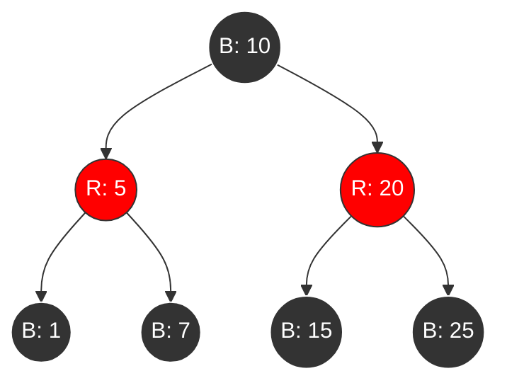

---
---

## Summary
**Red-Black Trees** are self-balancing Binary Search Trees that use a **color property** (Red or Black) on each node to maintain balance. They are less strictly balanced than AVL trees, requiring fewer rotations during updates, making them ideal for write-heavy applications. They are the underlying structure for many standard libraries (e.g., C++ `std::map`, Java `TreeMap`).

## Detailed Explanation
### Properties
A Red-Black tree must satisfy these invariants:
1.  **Color**: Every node is either Red or Black.
2.  **Root**: The root is always Black.
3.  **Leaves**: Every leaf (NIL) is Black.
4.  **Red Property**: If a node is Red, both its children must be Black (No two Reds in a row).
5.  **Black Height**: Every path from a node to its descendant leaves contains the same number of Black nodes.

### Balancing Operations
*   **Recoloring**: Changing a node's color. Fast, no structure change.
*   **Rotation**: Standard BST rotation (Left/Right). Used when recoloring isn't enough.

### Complexity
*   Height is at most $2\log(n+1)$.
*   Operations are guaranteed $O(\log n)$.

### Go Context
Go's standard library does not expose a Red-Black tree directly, but you can use `github.com/emirpasic/gods/trees/redblacktree`.

```go
package main

import (
	"fmt"
	rbt "github.com/emirpasic/gods/trees/redblacktree"
)

func main() {
	tree := rbt.NewWithIntComparator()
	
	// Insertions (Auto-balancing)
	tree.Put(1, "x") 
	tree.Put(2, "b")
	tree.Put(1, "a") // Updates value
	
	// Search
	val, found := tree.Get(2)
	if found {
		fmt.Println("Found:", val)
	}
}
```

## Interview Questions
**Q: Why is the root always black?**
A: It's a convention to simplify the Black Height property. If the root were Red, it wouldn't affect the relative black height of paths, but making it Black ensures the tree generally looks "anchored" and simplifies edge cases in root deletion.

**Q: What is the maximum height of a Red-Black tree?**
A: $2 \log(n+1)$. The longest path (alternating Red-Black) is at most twice as long as the shortest path (all Black).

**Q: Why prefer Red-Black over AVL?**
A: In general-purpose libraries, **Insert/Delete** performance is often more important than squeezing the last bit of Lookup performance. Red-Black trees require fewer rotations (max 3 for delete, 2 for insert) compared to AVL, making them faster for dynamic datasets.

## Diagram

