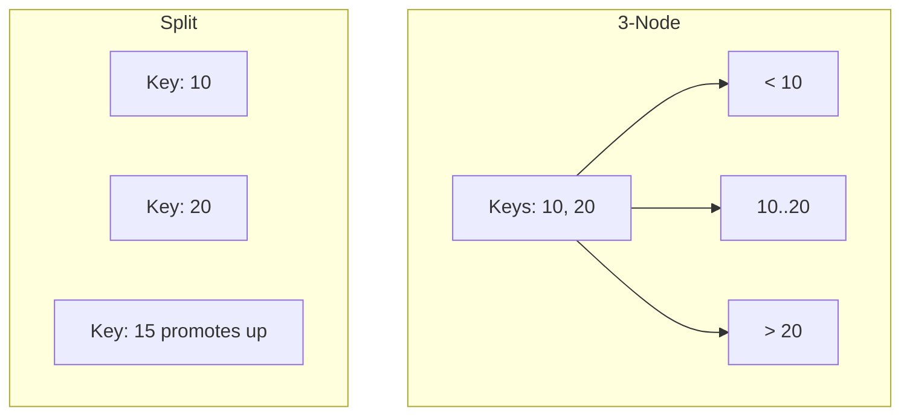

---
---

## Summary
**2-3 Search Trees** are a type of self-balancing search tree where every node can have 2 or 3 children (hence the name). They are a precursor to B-Trees and Red-Black trees. They maintain perfect balance (all leaf nodes are at the same depth) by growing upwards rather than downwards.

## Detailed Explanation
### Node Types
1.  **2-Node**: Stores 1 key, has 2 children (Left < Key, Right > Key). Like a standard BST node.
2.  **3-Node**: Stores 2 keys, has 3 children (Left < K1, Middle between K1-K2, Right > K2).

### Insertion Strategy
*   Insert at the leaf.
*   If the node has space (is a 2-node), it becomes a 3-node.
*   If the node is full (is a 3-node), it **splits** into two 2-nodes, and the middle key moves **up** to the parent.
*   This "promotion" can cascade up to the root, increasing tree height.

### Complexity
*   **Search/Insert/Delete**: Guaranteed $O(\log n)$.
*   **Balance**: Perfectly balanced (leaves always at same level).

### Go Context
You rarely implement 2-3 trees directly in production code. They are mostly studied as the theoretical basis for **Red-Black Trees** (a 3-node in a 2-3 tree corresponds to a "Red" node connected to a "Black" parent in an RB tree).

## Interview Questions
**Q: How does a 2-3 tree grow in height?**
A: Unlike a BST which grows down, a 2-3 tree grows **up**. When the root node splits due to an insertion, a new root is created, increasing the height by 1.

**Q: What is the relationship between 2-3 Trees and B-Trees?**
A: A 2-3 Tree is essentially a B-Tree of order 3 (max 3 children, max 2 keys).

## Diagram

