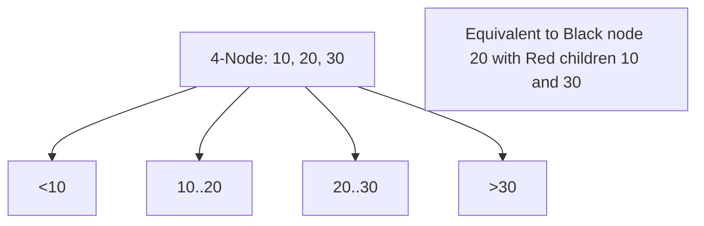

---
---

## Summary
**2-3-4 Trees** (also called **2-4 Trees**) are multi-way search trees where nodes can have 2, 3, or 4 children (storing 1, 2, or 3 keys). Like 2-3 trees, they are perfectly balanced. They are theoretically important because they are **isomorphic to Red-Black Trees**.

## Detailed Explanation
### Node Types
1.  **2-Node**: 1 key, 2 children.
2.  **3-Node**: 2 keys, 3 children.
3.  **4-Node**: 3 keys, 4 children.

### Isomorphism to Red-Black Trees
Every 2-3-4 tree can be mapped to a Red-Black tree:
*   **2-Node** $\to$ Black node.
*   **3-Node** $\to$ Black node with one Red child.
*   **4-Node** $\to$ Black node with two Red children.
This explains why Red-Black trees have the properties they do (e.g., black height).

### Operations
*   **Insertion**: Proactively split 4-nodes while traversing down (top-down insertion). This ensures that when you reach a leaf, there is room to insert or split without cascading back up.

### Go Context
Theoretical only. Use Red-Black trees (the binary implementation of 2-3-4 trees) for actual code.

## Interview Questions
**Q: Why are Red-Black trees preferred over 2-3-4 trees implementation-wise?**
A: 2-3-4 trees require handling dynamic node sizes (1, 2, or 3 keys) and complex pointer management (up to 4 children). Red-Black trees use standard binary nodes (2 children) with a simple boolean color flag, making memory allocation and manipulation much simpler and uniform.

**Q: What is the max height of a 2-3-4 tree with N elements?**
A: $\log_2 N$ (worst case, all 2-nodes) down to $\log_4 N$ (best case, all 4-nodes).

## Diagram

