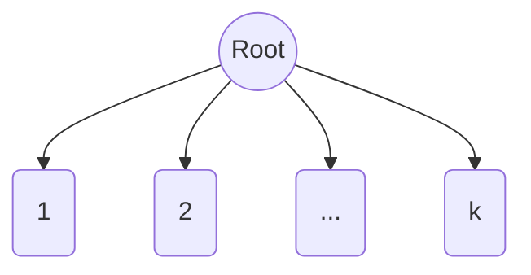

---
---

## Summary
A **K-ary Tree** (or **M-ary Tree**) is a generalized tree where each node has at most $k$ children. A Binary Tree is a specific case where $k=2$. These trees are useful when you need to store data with a branching factor greater than 2, such as in Tries (26-ary for alphabet) or spatial partitions (Quadtrees $k=4$, Octrees $k=8$).

## Detailed Explanation
### Structure
*   **Degree**: $k$ (branching factor).
*   **Height**: With $N$ nodes, height is approx $\log_k N$.
*   **Keys**: Usually stores $k-1$ keys to separate the $k$ subtrees.

### Comparison with Binary Trees
*   **Height**: K-ary trees are shallower (shorter height) than Binary trees for the same number of elements.
*   **Processing**: At each node, you have to decide between $k$ paths (more comparisons per node, but fewer nodes to traverse).

### Go Context
Used in specialized data structures.
*   **Trie**: `children [26]*Node`.
*   **Quadtree**: `children [4]*Node`.

```go
package main

// Example: Trie Node (26-ary tree)
type TrieNode struct {
	children [26]*TrieNode
	isEnd    bool
}

func (n *TrieNode) Insert(word string) {
	curr := n
	for _, char := range word {
		idx := char - 'a'
		if curr.children[idx] == nil {
			curr.children[idx] = &TrieNode{}
		}
		curr = curr.children[idx]
	}
	curr.isEnd = true
}
```

## Interview Questions
**Q: How does increasing 'k' affect tree operations?**
A: Increasing $k$ decreases the tree height ($\log_k N$), reducing the number of disk/memory accesses needed to reach a leaf. However, it increases the CPU time spent at each node to choose the correct child.

**Q: Where are K-ary trees used in 3D rendering?**
A: **Octrees** ($k=8$) are used to partition 3D space. Each node splits a cube into 8 smaller octants.

## Diagram

