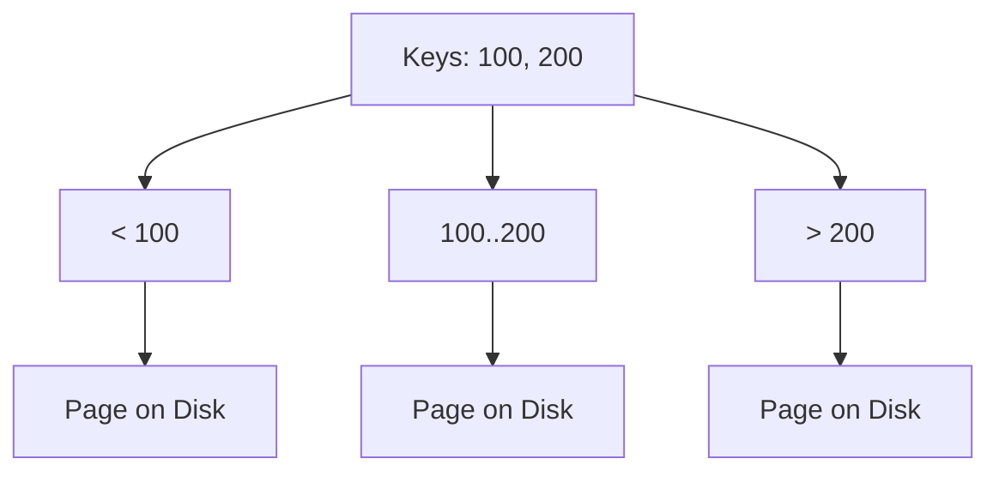

---
---

## Summary
**B-Trees** are self-balancing K-ary search trees optimized for systems that read and write large blocks of data, such as **Databases** and **File Systems**. Unlike binary trees, B-Trees have a high branching factor (hundreds or thousands of children), which keeps the tree very shallow, minimizing slow Disk I/O operations.

## Detailed Explanation
### Structure (Order $m$)
*   **Keys**: Internal nodes store multiple keys ($keys < m$).
*   **Children**: Internal nodes have up to $m$ children.
*   **Balance**: All leaf nodes appear at the same level.
*   **Rules**: Root has at least 2 children. Internal nodes have at least $\lceil m/2 \rceil$ children (half full).

### Why Disk I/O?
Disk access is slow (milliseconds). RAM is fast (nanoseconds).
*   AVL Tree: Height 20 (20 disk seeks).
*   B-Tree ($m=100$): Height 3 (3 disk seeks).
B-Trees read a whole "Page" (4KB or 16KB) of keys at once, utilizing disk bandwidth effectively.

### B+ Tree Variant
Most modern databases (MySQL, Postgres) use **B+ Trees**.
*   **B-Tree**: Data stored in internal nodes and leaves.
*   **B+ Tree**: Data stored **only in leaves**. Internal nodes are just for routing. Leaves are linked (Linked List) for fast range scans (`SELECT * FROM users WHERE id > 100`).

### Go Context
Used in key-value stores like **BoltDB** (Go-native B+ Tree DB) and `google/btree`.

```go
package main

import (
	"fmt"
	"github.com/google/btree"
)

type Int int
func (a Int) Less(b btree.Item) bool { return a < b.(Int) }

func main() {
	// B-Tree with degree 2 (2-3-4 tree roughly)
	tr := btree.New(2)
	
	tr.ReplaceOrInsert(Int(10))
	tr.ReplaceOrInsert(Int(20))
	tr.ReplaceOrInsert(Int(5))
	
	tr.Ascend(func(i btree.Item) bool {
		fmt.Println(i)
		return true // continue
	})
}
```

## Interview Questions
**Q: Why are B-Trees preferred for Databases?**
A: They minimize the number of disk reads needed to find a record. Since one node = one disk page, and the tree is shallow, you can find any record in a 1TB database with just 3-4 disk reads.

**Q: Difference between B-Tree and B+ Tree?**
A: B+ Trees store all data at leaf nodes, and leaves are linked. This makes range queries (scanning sequential data) much faster than in a B-Tree, where you'd have to traverse up and down the tree.

## Diagram

