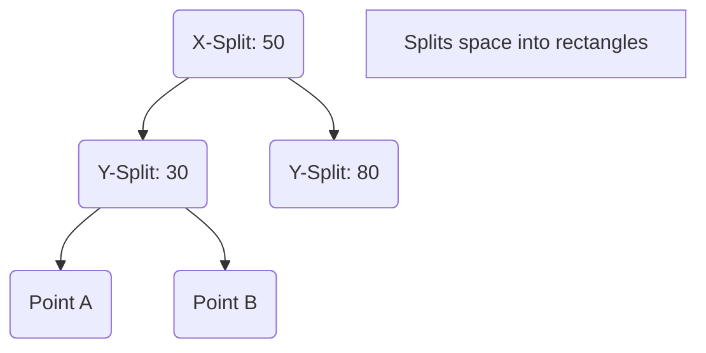

---
---

## Summary
**K-D Trees (k-Dimensional Trees)** are binary trees used to organize points in a k-dimensional space. They are essentially a generalization of BSTs to multi-dimensional keys (e.g., coordinates $x, y, z$). They are widely used for **Nearest Neighbor (NN) search** and range queries in spatial applications.

## Detailed Explanation
### Construction
*   Level 0: Split by X-coordinate (sort points by X, median is root).
*   Level 1: Split by Y-coordinate.
*   Level 2: Split by Z-coordinate.
*   Level 3: Split by X-coordinate (cycle repeats).

### Nearest Neighbor Search
To find the closest point to $P(x,y)$:
1.  Traverse down the tree like a BST to find the target region.
2.  Unwind recursion (backtrack).
3.  Pruning: If the distance to the current "best" is shorter than the perpendicular distance to the splitting plane, you don't need to check the other side of the plane.

### Go Context
Used in geospatial libraries for Go or game engines.

```go
// Conceptual Node Structure
type KDNode struct {
    Point []float64 // [x, y, z]
    Left  *KDNode
    Right *KDNode
    Axis  int       // 0=x, 1=y, ...
}
```

## Interview Questions
**Q: What is the worst-case complexity for Nearest Neighbor in K-D Tree?**
A: $O(n)$ in high dimensions. K-D trees suffer from the **Curse of Dimensionality**. For high dimensions (e.g., $k > 20$), they perform no better than brute force.

**Q: How do you handle inserting a point into a K-D tree?**
A: Similar to BST. Traverse down comparing coordinates based on the current level's axis. When you hit nil, insert. Note: The tree can become unbalanced (like a naive BST), so rebalancing (re-building) is sometimes needed.

## Diagram

