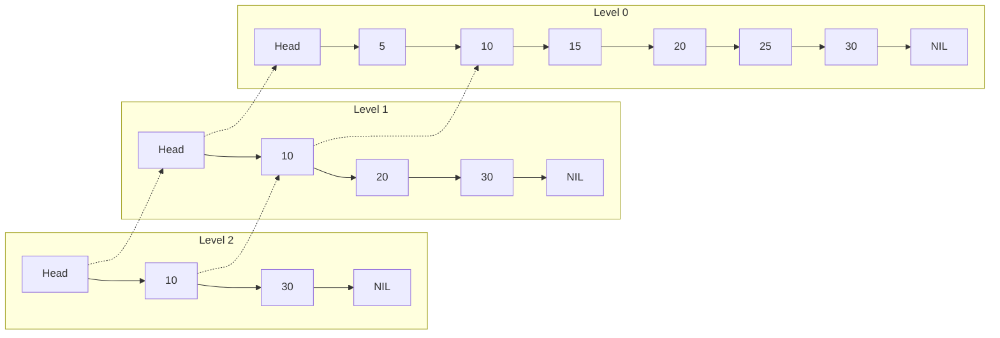

---
---

## Summary
**Skip Lists** are probabilistic data structures that allow $O(\log n)$ search, insert, and delete complexity, similar to balanced trees, but using a **multi-level linked list**. They are simpler to implement than AVL/Red-Black trees and are lock-free friendly, making them popular in concurrent systems.

## Detailed Explanation
### Structure
*   **Level 0**: Standard sorted linked list containing all elements.
*   **Level 1**: Contains ~50% of elements (skipped).
*   **Level 2**: Contains ~25% of elements.
*   **Level k**: Express lane.

### Search Strategy
Start at the top level.
1.  Move right as long as the next node value is less than target.
2.  If next node > target, move down one level.
3.  Repeat until target found or level 0 checked.

### Go Context
Used in **Redis** (Sorted Sets) and **LevelDB/RocksDB** (MemTable).
There is no standard Go library, but implementation is straightforward.

```go
package main

import (
	"fmt"
	"math/rand"
)

const maxLevel = 16

type Node struct {
	key     int
	forward []*Node // Array of pointers for different levels
}

type SkipList struct {
	head  *Node
	level int
}

func (s *SkipList) Search(key int) bool {
	current := s.head
	// Go down from top level
	for i := s.level; i >= 0; i-- {
		// Go right
		for current.forward[i] != nil && current.forward[i].key < key {
			current = current.forward[i]
		}
	}
	// Check next node at level 0
	current = current.forward[0]
	return current != nil && current.key == key
}
```

## Interview Questions
**Q: Why use a Skip List instead of a Red-Black tree?**
A: Skip lists are easier to implement (no complex rotations). They are also easier to make **concurrent/lock-free** because changes are localized updates to pointers, whereas rebalancing a tree touches many nodes up the hierarchy.

**Q: What is the space complexity?**
A: $O(n)$ average. Each node has an expected height of 2 pointers (1/2 prob of level 1, 1/4 prob of level 2...).

## Diagram

