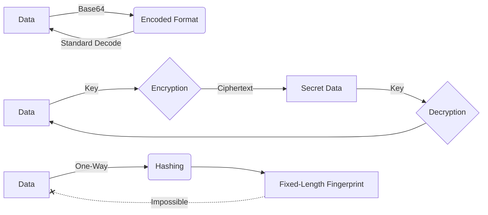

---
---

# Hashing, Encryption, and Encoding

Understanding the fundamental differences between these three data transformation techniques is crucial for security and software engineering.

## 1. Definitions
These mechanisms serve completely different primary goals:

*   **Encoding (Format)**: Transforms data into a new format to ensure it can be safely consumed by different systems. It focuses on **usability and compatibility**, not security.
*   **Encryption (Confidentiality)**: Transforms data into an unreadable format (ciphertext) using a key. Its primary goal is **confidentiality**, ensuring only authorized parties can access the original data.
*   **Hashing (Integrity)**: Maps data of any size to a fixed-length string of characters (digest). Its primary goal is **integrity**, providing a unique "fingerprint" to verify that data hasn't been tampered with.

## 2. Characteristics & Reversibility

| Characteristic | Encoding | Encryption | Hashing |
| :--- | :--- | :--- | :--- |
| **Primary Goal** | Compatibility / Format | Confidentiality | Integrity |
| **Reversibility** | **Yes** (Anyone can decode) | **Yes** (Requires the key) | **No** (One-way function) |
| **Key Required** | No | Yes | No (typically) |
| **Output Size** | Varies with input | Varies with input | **Fixed** (regardless of input size) |

## 3. Common Formats
*   **Encoding**: **Base64** (used for binary data in text environments), Hexadecimal, URL Encoding.
*   **Encryption**: **AES** (Advanced Encryption Standard - Symmetric), RSA (Asymmetric), ChaCha20.
*   **Hashing**: **SHA-256** (Secure Hash Algorithm), MD5 (deprecated for security), Bcrypt (optimized for passwords).

## 4. Go Implementation
Go provides robust standard library support for these operations.

```go
package main

import (
	"crypto/aes"
	"crypto/cipher"
	"crypto/rand"
	"crypto/sha256"
	"encoding/base64"
	"encoding/hex"
	"fmt"
	"io"
)

func main() {
	data := []byte("Hello, World!")

	// --- 1. Encoding (Base64) ---
	encoded := base64.StdEncoding.EncodeToString(data)
	fmt.Printf("Base64 Encoded: %s\n", encoded)

	// --- 2. Hashing (SHA-256) ---
	hash := sha256.Sum256(data)
	fmt.Printf("SHA-256 Hash: %s\n", hex.EncodeToString(hash[:]))

	// --- 3. Encryption (AES-GCM) ---
	// Key must be 16, 24, or 32 bytes for AES-128, AES-192, or AES-256
	key := make([]byte, 32) 
	if _, err := io.ReadFull(rand.Reader, key); err != nil {
		panic(err)
	}

	block, _ := aes.NewCipher(key)
	gcm, _ := cipher.NewGCM(block)

	// Nonce should be unique for every encryption
	nonce := make([]byte, gcm.NonceSize())
	io.ReadFull(rand.Reader, nonce)

	// Encrypt and authenticate the data
	ciphertext := gcm.Seal(nonce, nonce, data, nil)
	fmt.Printf("AES-GCM Encrypted: %x\n", ciphertext)
}
```

## 5. Interview Questions

**Q1: Is Base64 a form of encryption?**
**A:** No. It is an encoding scheme. It provides zero security because it doesn't use a key and anyone can reverse it using standard algorithms. It's meant for data transmission (e.g., embedding images in CSS or HTML).

**Q2: Can you reverse a hash to get the original data?**
**A:** No. Hashing is a one-way mathematical function. It is designed to be irreversible. However, "reversing" can be attempted via brute-force or pre-computed Rainbow Tables, which is why we use **Salts** for passwords.

**Q3: Why do we hash passwords instead of encrypting them?**
**A:** If passwords are encrypted, the system must store the decryption key. If a hacker steals the database and the key, they can read all passwords. With hashing, the original password is never stored; even the system admin cannot see it. We only compare hashes during login.

**Q4: What is the difference between Symmetric and Asymmetric encryption?**
**A:** Symmetric encryption (like AES) uses the **same key** for both encryption and decryption. Asymmetric encryption (like RSA) uses a **Public Key** for encryption and a different **Private Key** for decryption.

**Q5: What is a "Collision" in hashing?**
**A:** A collision occurs when two different inputs produce the exact same hash output. While theoretically possible for any hashing algorithm (since there are infinite inputs and finite outputs), modern algorithms like SHA-256 make it computationally nearly impossible.

## Visual Summary

