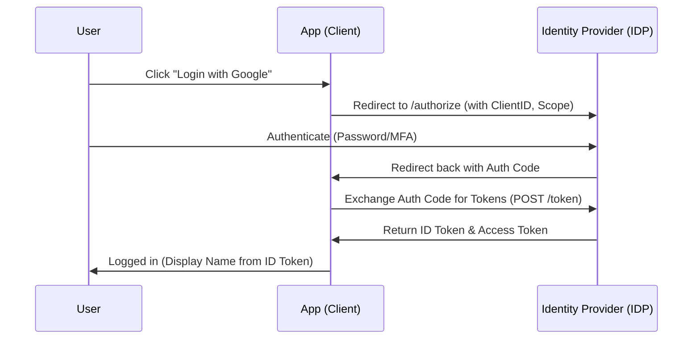

---
---
#security #architecture #computerscience

# Authentication Strategies

## Summary
Authentication (AuthN) is the process of verifying a user's identity. Modern web architecture primarily distinguishes between **Session-based** (stateful) and **Token-based** (stateless) strategies. While **OAuth 2.0** handles authorization, **OpenID Connect (OIDC)** extends it for identity management. Modern security trends are shifting towards **Passwordless** methods (like Passkeys/WebAuthn) and **MFA** to mitigate credential-based attacks.

---

## Detailed Explanation

### 1. Session-based vs. Token-based Authentication

| Feature | Session-based (Cookies) | Token-based (JWT) |
| :--- | :--- | :--- |
| **State** | Stateful (stored on server) | Stateless (stored on client) |
| **Storage** | Server DB/Redis + Client Cookie | Client LocalStorage/Memory/Cookie |
| **Scalability** | Harder (requires session sharing/sticky sessions) | Easier (server doesn't track sessions) |
| **Revocation** | Easy (delete session from server) | Hard (requires blacklisting/short TTLs) |
| **Security** | CSRF vulnerable (needs tokens) | XSS vulnerable (if stored in LocalStorage) |

**Recommendation**: Use Sessions for high-security internal apps requiring instant revocation. Use JWTs for microservices, mobile apps, and high-traffic APIs.

### 2. Protocols: OAuth 2.0 vs. OIDC
*   **OAuth 2.0 (Authorization)**: A framework that allows applications to obtain limited access to user accounts on an HTTP service. It uses **Access Tokens**.
    *   *Analogy*: A valet key for your car (limited access).
*   **OIDC (Authentication)**: An identity layer on top of OAuth 2.0. It introduces the **ID Token**, which is a JWT containing user profile information (claims).
    *   *Analogy*: An ID card showing who you are.

### 3. Modern Concepts
*   **MFA (Multi-Factor Authentication)**: Combining something you **know** (password), something you **have** (TOTP app, hardware key), or something you **are** (biometrics).
*   **SSO (Single Sign-On)**: A centralized login system (e.g., Okta, Auth0, Google) using SAML or OIDC to provide access to multiple applications with one set of credentials.
*   **Passwordless**:
    *   **Magic Links/OTPs**: Sending a one-time link/code to email or SMS.
    *   **Passkeys (WebAuthn/FIDO2)**: Uses public-key cryptography and biometrics (TouchID/FaceID) to replace passwords entirely. It is highly resistant to phishing.

### 4. Authentication Flow (OIDC)


---

## Go Implementation: JWT Creation and Validation

In Go, `github.com/golang-jwt/jwt/v5` is the standard library for handling JWTs.

```go
package auth

import (
	"errors"
	"fmt"
	"time"

	"github.com/golang-jwt/jwt/v5"
)

var secretKey = []byte("your-highly-secure-secret-key")

// CustomClaims defines the structure of our JWT payload
type CustomClaims struct {
	UserID   string `json:"user_id"`
	Username string `json:"username"`
	Role     string `json:"role"`
	jwt.RegisteredClaims
}

// CreateToken generates a new JWT for a user
func CreateToken(userID, username, role string) (string, error) {
	claims := CustomClaims{
		UserID:   userID,
		Username: username,
		Role:     role,
		RegisteredClaims: jwt.RegisteredClaims{
			ExpiresAt: jwt.NewNumericDate(time.Now().Add(15 * time.Minute)), // Short-lived
			IssuedAt:  jwt.NewNumericDate(time.Now()),
			Issuer:    "my-go-service",
		},
	}

	token := jwt.NewWithClaims(jwt.SigningMethodHS256, claims)
	return token.SignedString(secretKey)
}

// ValidateToken parses and validates the JWT string
func ValidateToken(tokenString string) (*CustomClaims, error) {
	token, err := jwt.ParseWithClaims(tokenString, &CustomClaims{}, func(token *jwt.Token) (interface{}, error) {
		// Ensure the signing method is HMAC
		if _, ok := token.Method.(*jwt.SigningMethodHMAC); !ok {
			return nil, fmt.Errorf("unexpected signing method: %v", token.Header["alg"])
		}
		return secretKey, nil
	})

	if err != nil {
		return nil, err
	}

	if claims, ok := token.Claims.(*CustomClaims); ok && token.Valid {
		return claims, nil
	}

	return nil, errors.New("invalid token")
}
```

---

## Interview Preparation Questions

**1. Q: What is the main security risk of storing JWTs in `localStorage`?**
**A:** The primary risk is **XSS (Cross-Site Scripting)**. If an attacker injects a malicious script into your site, they can read `localStorage` and steal the token. Storing tokens in `HttpOnly` cookies is generally safer as they are inaccessible to JavaScript.

**2. Q: How do you handle JWT revocation if a token is stolen?**
**A:** Since JWTs are stateless, they can't be revoked easily. Strategies include:
*   Keeping **short TTLs** (expiry times).
*   Using **Refresh Tokens** stored in a DB/Redis; you can "revoke" the user by deleting the refresh token.
*   Implementing a **Blacklist/Denylist** in Redis for stolen tokens until they expire.

**3. Q: Explain the difference between `ID Token` and `Access Token` in OIDC.**
**A:** An `ID Token` (JWT) is for the client application to know **who** the user is (authentication). An `Access Token` (often opaque) is used to **authorize** access to protected resources (APIs).

**4. Q: Why are Passkeys (WebAuthn) considered more secure than traditional passwords?**
**A:** Passkeys use asymmetric cryptography. The private key never leaves the user's device, and the public key on the server is useless if stolen. They are also inherently **phishing-resistant** because the browser ensures the origin matches the registered domain.

**5. Q: What is PKCE and why is it used in OAuth 2.0?**
**A:** **Proof Key for Code Exchange (PKCE)** is an extension to the Authorization Code flow. It prevents "authorization code injection" attacks. It is now recommended for **all** clients (SPAs, Mobile, and even Server-side apps) instead of the implicit flow.
