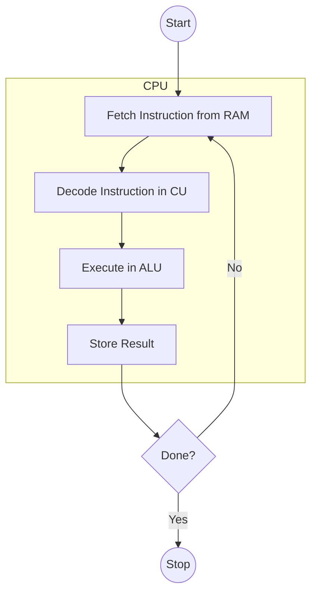

---
---

## Summary
The CPU (Central Processing Unit) executes programs through a continuous cycle known as the **Fetch-Decode-Execute** cycle (or Machine Cycle). Every program, regardless of language, is eventually compiled or interpreted into machine code instructions that the CPU processes one by one.

## Detailed Explanation
### The Machine Cycle
1.  **Fetch**: The CPU retrieves the next instruction from memory (RAM) using the address stored in the **Program Counter (PC)**. The instruction is stored in the **Instruction Register (IR)**.
2.  **Decode**: The **Control Unit (CU)** interprets the instruction (opcode) to determine what action to perform (e.g., ADD, LOAD, JUMP).
3.  **Execute**: The CPU performs the action. This might involve the **ALU** (Arithmetic Logic Unit) for math, or moving data between registers.
4.  **Store**: (Optional) The result is written back to a register or memory.

### Key Components
*   **Program Counter (PC)**: A special register that points to the *next* instruction to be executed.
*   **Control Unit (CU)**: The "conductor" that directs traffic inside the CPU.
*   **ALU**: The "calculator" that performs math and logic.

### Go Context
When you run a Go program, the OS loads the compiled binary into memory. The OS Scheduler sets the CPU's PC to the entry point of your program.
*   **Goroutines**: The Go Runtime has its own scheduler. It swaps Goroutines on and off OS threads. This involves saving the PC and Registers of the paused Goroutine so it can resume later (Context Switching).

## Interview Questions
**Q: What is the Program Counter (PC)?**
A: It is a special register that holds the memory address of the next instruction to be executed. It is automatically incremented after each fetch (unless a JUMP instruction changes it).

**Q: How does a CPU "jump" or loop?**
A: A JUMP (or BRANCH) instruction simply modifies the value of the Program Counter (PC) to a different memory address, causing the next Fetch cycle to retrieve instructions from that new location.

**Q: What is a Clock Cycle?**
A: The speed at which the CPU executes the Fetch-Decode-Execute steps. Measured in Hz (e.g., 3 GHz = 3 billion cycles per second). Modern CPUs use pipelining to overlap these stages.

## Diagram

