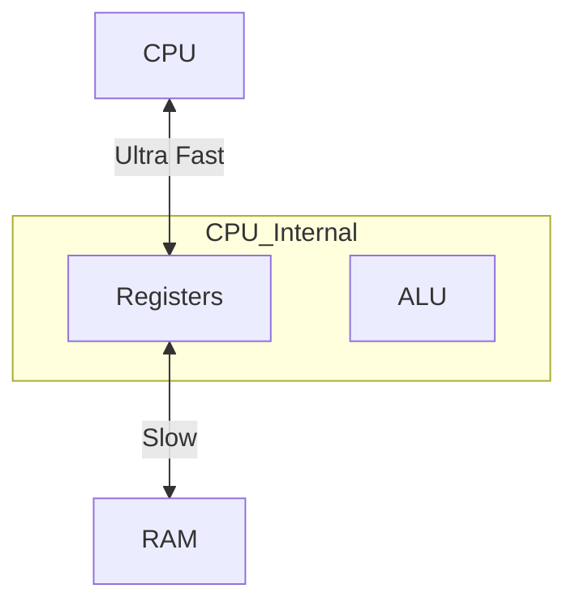

---
---

## Summary
**Registers** are tiny, ultra-fast storage locations directly inside the CPU. **RAM** (Random Access Memory) is the main memory where active programs and data live. The CPU works by moving data from RAM into Registers, processing it, and moving it back.

## Detailed Explanation
### Registers
The fastest memory hierarchy. Access time: < 1 nanosecond.
*   **General Purpose**: Used for variables and temporary calculations (e.g., AX, BX, CX in x86).
*   **Special Purpose**:
    *   **SP (Stack Pointer)**: Points to the top of the current stack frame.
    *   **BP (Base Pointer)**: Points to the base of the current stack frame (for accessing local vars).
    *   **PC (Program Counter)**: Points to the next instruction.
    *   **Flags**: Stores status of last operation (Zero flag, Overflow flag).

### RAM (Main Memory)
Large capacity, volatile storage. Access time: ~100 nanoseconds.
*   **Von Neumann Architecture**: Code (instructions) and Data (variables) are stored in the *same* memory space.
*   **Stack**: Structured memory (LIFO) for function calls and local variables.
*   **Heap**: Unstructured memory for dynamic allocation (objects that outlive a function).

### Go Context
*   **Registers**: The Go compiler attempts to keep frequently used variables in registers (Register Allocation) for speed.
*   **Stack vs Heap**: Go uses Escape Analysis. If a variable "escapes" the function (e.g., returning a pointer), it goes to the Heap. If it stays local, it lives on the Stack (fast allocation/cleanup).

```go
package main

// 'x' stays on Stack (fast)
func add(a, b int) int {
	x := a + b
	return x
}

// 'y' escapes to Heap (pointer returned)
func createPointer(val int) *int {
	y := val
	return &y
}
```

## Interview Questions
**Q: Why do we need Registers if we have RAM?**
A: RAM is too slow. The CPU runs at GHz speeds (nanoseconds), while RAM is much slower. Without registers, the CPU would spend most of its time waiting for data to arrive from RAM.

**Q: What happens to the Stack Pointer (SP) when a function is called?**
A: The SP is decremented (or incremented, depending on architecture) to allocate space for the new function's stack frame (local variables and return address). When the function returns, the SP is moved back, effectively "freeing" the memory instantly.

## Diagram

